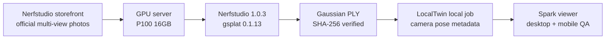

# Run Report: SCENE-006

## Result

```text
status: passed with follow-up
worker: etri-gpu / Tesla P100-PCIE-16GB
source: Nerfstudio official storefront sample
deployment: none, local validation only
```

## Pipeline



## Evidence

| Item | Result |
| --- | --- |
| Official sample download | `storefront`, 2.5GB prepared dataset |
| GPU | Tesla P100-PCIE-16GB, GPU 4 only |
| Runtime | Python 3.10, PyTorch 2.1.2+cu118 |
| P100 compatibility | Nerfstudio 1.0.3, gsplat 0.1.13, CUDA arch `6.0` |
| Training | initial 3,000 + resumed 10,000 iterations, final checkpoint step `12999` |
| Export asset | 133,419,827 bytes |
| SHA-256 | `29492c045ac9d02c45986ca62095563ddd8844a54680c149547da5c475ab04ae` |
| Spark load | 537,977 splats |
| Scale outlier filter | threshold `0.092030`, 1,153 splats hidden in viewer only |
| Desktop pixels | 385,259 / 432,400 non-background, 89.10% |
| Mobile | viewport 390px, scroll width 390px, canvas 342x387 |

## Findings

`poster`는 Google Drive 공개 링크 제한으로 내려받지 못했고, 같은 공식 목록의 실제 거리 장면인 `storefront`로 교체했다. 단일 360 panorama 한 장은 시차가 없어 3D 복원 입력으로 충분하지 않다. 이동 촬영한 360 영상 또는 겹침이 있는 다중 시점 사진이 필요하다.

P100은 gsplat 1.4의 CUDA/Triton 요구사항을 충족하지 못했다. 공식 의존 범위 안에서 `Nerfstudio 1.0.3 + gsplat 0.1.13`을 사용했고, CUDA 11.8 kernel을 `sm_60`으로 빌드해 실제 학습과 export를 완료했다.

초기 camera는 전체 bounds 추정이 아니라 Nerfstudio의 `transforms.json`과 `dataparser_transforms.json`에서 복원했다. 이 경로로 원본 첫 사진의 벽돌 상점 전면과 일치하는 화면을 확인했다.

## Local Artifacts

아래 파일은 `.gitignore` 대상이며 배포하지 않는다.

```text
data/scenes/server-validation/storefront/scene-12999.ply
data/scenes/server-validation/storefront/validation-report-12999.json
output/server-validation/storefront-render-camera-corrected.png
output/server-validation/storefront-render-mobile.png
```

## Follow-up

- [ ] 사용자 촬영 360 영상 또는 다중 시점 사진으로 end-to-end 재검증
- [ ] 새 GPU worker에서는 Nerfstudio 1.1.5 / gsplat 1.4 경로 재검증
