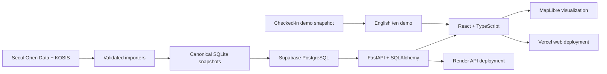

# LocalTwin — Explainable Neighborhood Market Analysis

LocalTwin helps prospective small-business owners compare a Seoul neighborhood before choosing a storefront. It combines nearby-store discovery, official public data, spatial context, and an explainable score without presenting the result as a prediction or guarantee of success.

> **Built for OpenAI Build Week with Codex and GPT-5.6.** Codex was used throughout planning, harness design, implementation, debugging, testing, deployment, and documentation—not only for generating isolated code snippets.

[Try the English demo](https://localtwin-product.vercel.app/en) · [Open the Korean live product](https://localtwin-product.vercel.app/) · [Check API health](https://localtwin-api.onrender.com/health)

## The problem LocalTwin solves

Choosing a storefront usually means comparing fragmented information: nearby competitors, openings and closures, estimated sales, foot traffic, population, geographic boundaries, and the period each dataset represents. Raw public data makes these signals available, but it does not make them easy to interpret together.

LocalTwin turns that evidence into one inspectable workflow:

1. Choose a supported market area or a custom map location.
2. Set a radius and business category.
3. Explore nearby stores and category density on the map.
4. Review competition, turnover, sales, foot traffic, and population context.
5. Inspect the source, period, geographic unit, limitations, and score evidence behind the result.

The current public scope is intentionally limited to **Yeonnam, Hongdae, and Hapjeong**. This is a neighborhood-scale vertical slice, not a claim of Seoul-wide coverage.

## How Codex and GPT-5.6 were used

The project used **Codex with GPT-5.6 as a development partner across the complete engineering loop**. The human owner set the product direction, approved scope and risk decisions, and reviewed the resulting behavior. Codex supported the following work:

| Stage | Codex + GPT-5.6 contribution | Repository evidence |
| --- | --- | --- |
| Planning | Converted product goals into bounded tasks, acceptance criteria, dependencies, and explicit non-goals | [Pre-development decisions](docs/development/pre-development-decisions.md), [product plan](docs/wiki/localtwin-product-plan.md) |
| Harness setup | Established task packets, run reports, documentation-sync rules, failure recording, and completion gates | [Dev Harness](docs/development/harness.md), [harness policy](.harness/policies/p0-policy.md), [templates](.harness/templates/task-packet.md) |
| Architecture | Helped separate React, map, API, database, importer, deployment, and optional 3D boundaries | [System architecture](docs/development/architecture.md), [architecture guardrail task](.harness/tasks/ARCH-004-refactoring-guardrails.md) |
| Implementation | Assisted with React state and UI boundaries, MapLibre layers, FastAPI routers, SQLAlchemy repositories, Alembic migrations, and data import validation | [Radius-analysis task](.harness/tasks/ANALYSIS-002-radius-search.md), [matching run report](.harness/runs/2026-07-16-ANALYSIS-002-radius-search.md) |
| Verification | Added and ran focused tests, browser smoke checks, type checks, linting, builds, and API/database verification | [Validation guide](docs/development/validation.md), [front/API smoke task](.harness/tasks/EVAL-002-front-api-smoke.md), [smoke run report](.harness/runs/2026-07-16-EVAL-002-front-api-smoke.md) |
| Learning loop | Turned failures and repeated problems into new harness guardrails instead of hiding them | [Failure log](docs/evaluation/failure-log.md), [agent rubric](docs/evaluation/agent-rubric.md) |

The full development record is included in [`docs/`](docs/wiki/Home.md) and [`.harness/`](.harness/README.md). These files show the plans, task packets, run reports, architecture decisions, validation rules, and failure-driven harness changes used during development.

## Key features

- Interactive MapLibre map with supported market boundaries and nearby-store markers.
- Market-area or custom-radius analysis for `100 m`, `300 m`, and `500 m`.
- Category-specific analysis for cafes, restaurants, bakeries, and convenience stores.
- Same-category competition, openings and closures, estimated sales, and foot-traffic context.
- Market-area and administrative-district population shown as separate spatial units.
- Explainable location score with confidence, evidence, limitations, source, and period context.
- English submission route backed by a checked-in, verified analysis snapshot.
- Korean live product connected through the deployed API and production database.

## Technical architecture



### Main technologies

- **Web:** React 19, TypeScript, Vite, MapLibre GL, Three.js boundaries kept lazy and outside the submitted flow.
- **API:** FastAPI, Pydantic, SQLAlchemy, Alembic.
- **Data:** Seoul public datasets, KOSIS statistics, canonical SQLite validation snapshots, Supabase PostgreSQL runtime data.
- **Quality:** Vitest, Testing Library, Pytest, Ruff, ESLint, Prettier, TypeScript, browser smoke tests.
- **Deployment:** Vercel for the web application and Render for the API.

## Run locally

Requirements:

- Node.js `>=24.11.0 <25`
- pnpm `11.7.0`
- Python managed by [`uv`](https://docs.astral.sh/uv/)

From the repository root:

```powershell
cd product
pnpm install --frozen-lockfile
uv sync --directory apps/api
Copy-Item .env.example .env
Copy-Item apps/web/.env.example apps/web/.env.local
pnpm dev
```

Open:

- Korean live development route: `http://127.0.0.1:5173/`
- English submission route: `http://127.0.0.1:5173/en`
- FastAPI health check: `http://127.0.0.1:8000/health`

Keep server-only credentials in `product/.env`. Do not place database URLs, API keys, or tokens in the browser environment.

## Test and demo

Run the full repository check:

```powershell
cd product
pnpm check
```

This runs formatting checks, TypeScript checks, web and API linting, Vitest and Pytest suites, and the production web build.

For a quick manual demo:

1. Open [the English demo](https://localtwin-product.vercel.app/en).
2. Select **Custom area**, a radius, and **Cafe**.
3. Choose a store marker on the map.
4. Review the location score, competition, openings and closures, and activity by time of day.
5. Scroll to population evidence and confirm that source period and spatial unit remain visible.
6. Open score evidence or market comparison to inspect how the result is supported.

The `/en` route clearly identifies its checked-in snapshot and does not present it as a live query. The deployed API can require a brief warm-up before the first Korean live-product request.

## Repository layout

```text
.harness/             Codex task packets, run reports, policies, and evaluations
docs/                 Planning, architecture, data, feature, validation, and failure records
product/
  apps/web/           React + Vite + TypeScript + MapLibre interface
  apps/api/           FastAPI analysis, search, score, and optional scene APIs
  data/               Canonical and generated-data boundaries
  scripts/            Import, deployment, and operational helpers
```

## Development documentation

Start with these documents:

- [Product plan](docs/wiki/localtwin-product-plan.md)
- [Pre-development decision gates](docs/development/pre-development-decisions.md)
- [System architecture](docs/development/architecture.md)
- [Dev Harness](docs/development/harness.md)
- [Validation guide](docs/development/validation.md)
- [Database structure](docs/data/database-structure.md)
- [Data-source mapping](docs/data/data-source-mapping.md)
- [Market-analysis specification](docs/features/market-analysis.md)
- [Agent evaluation rubric](docs/evaluation/agent-rubric.md)
- [Failure log](docs/evaluation/failure-log.md)
- [Full documentation index](docs/wiki/Home.md)
- [Full harness archive](.harness/README.md)

Some documents preserve experiments and future-looking work that are not part of this Build Week submission. The submitted demo excludes 3DGS scene creation and user-capture processing.

## Public submission repository

The working repository was created as a fork whose visibility could not be changed. This standalone repository is the public Build Week submission mirror so the implementation and its development evidence can be reviewed together.

## License

MIT. See [LICENSE](LICENSE).
