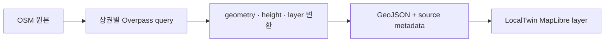
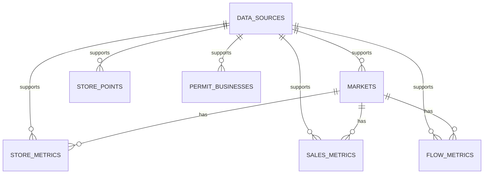

# LocalTwin v0.1 데이터 소스 매핑

이 문서는 LocalTwin v0.1에 필요한 공공데이터가 충분한지 판단하고, 원천 데이터와 내부 canonical schema를 연결하기 위한 기준 문서다. 실제 table의 PK/FK, grain과 ERD는 [데이터베이스 구조](./database-structure.md)에서 확인한다.

## 1. 결론

v0.1 MVP 기준으로는 필요한 최소 데이터가 충분하다.

다만 이 결론은 다음 범위에서만 성립한다.

```text
LocalTwin v0.1:
공공데이터와 제한된 관찰값을 바탕으로
후보 상권의 경쟁 강도, 개폐업 흐름, 시간대별 특성을
한 화면에서 이해하도록 돕는 상권 분석 데모 서비스
```

상용 수준의 창업 컨설팅, 매출 예측, 생존율 예측 서비스까지 하려면 추가 데이터가 필요하다.

```text
매출/카드 소비 데이터
임대료/공실 데이터
실제 보행 유동인구
교통 접근성
상권별 업종 생존율
경쟁점 리뷰/평점
계절/날씨/이벤트 데이터
```

2026-07-09 논의에서 다음 데이터를 추가 조사 대상으로 정리했다. 이 목록은 확보 완료를 의미하지 않는다.

```text
남성/여성 인구
주거인구
유동인구
카드매출
지역별 매출 순위
평균 영업기간
신생기업 생존율
개폐업 현황
업종 분포
요일별 분석
시간대별 분석
종합분석
```

실제 원천 필드, 공간·시간 단위, 이용 조건과 갱신 주기를 확인한 뒤 v0.1 포함 여부를 결정한다.

## 2. 기능별 데이터 충분성

| 기능 | 필요한 데이터 | v0.1 가능 여부 |
| --- | --- | --- |
| 지도에서 홍대/신촌/관평동 보기 | 상권정보, 지도 좌표 | 가능 |
| 점포 마커 표시 | 소상공인 상가/상권정보 | 가능 |
| 카페/음식점 필터 | 상가업종정보, 일반/휴게음식점 | 가능 |
| 반경 100m/300m/500m 경쟁 분석 | 점포 좌표, 업종 | 가능 |
| 개업/폐업 흐름 | 일반음식점/휴게음식점 인허가 | 가능 |
| 서울 홍대/신촌 시간대 유동 | 서울 생활인구 | 가능 |
| 관평동 시간대 유동 | 수동 관찰값 | 부분 가능 |
| 입지 점수 | 상권정보, 인허가, 유동/관찰값 | 가능 |
| 템플릿 리포트 | 분석 결과 조합 | 가능 |
| 관평동 3D 데모 | 직접 촬영, 수동 관찰, 3D asset | 공공데이터만으로는 불가 |

### 2.1 원본 데이터, 계산 지표와 UI 구분

| 구분 | 항목 |
| --- | --- |
| 원본 데이터 후보 | 성별 인구, 주거인구, 유동인구, 카드매출, 업종, 개업일, 폐업일, 영업 상태 |
| 계산 지표 | 지역별 매출 순위, 평균 영업기간, 신생기업 생존율, 업종 분포, 개폐업 순증감 |
| 분석 View | 요일별 인구/매출, 시간대별 인구/매출, 종합분석 |
| UI Filter | 지역, 업종, 반경, 기간, 요일, 시간대, 성별 |

`업종별 filter`는 원본 데이터가 아니라 정규화된 업종 field를 사용하는 UI 기능이다.

## 3. 필수 데이터

### 3.1 소상공인시장진흥공단 상권정보

역할:

```text
Store 데이터 원천
```

사용 목적:

```text
점포 마커
업종 필터
카페/음식점 분류
반경 내 동일 업종 수
경쟁 강도
```

공식 설명 기준으로 상가업소정보와 상가업종정보를 파일데이터와 OpenAPI로 제공하며, 상호명, 지점명, 주소, 도로명, 상권번호, 표준산업분류코드, 업종 대/중/소분류를 포함한다.

### 3.2 일반음식점 인허가 데이터

역할:

```text
PermitBusiness 데이터 원천
```

사용 목적:

```text
음식점 개업 흐름
음식점 폐업 흐름
최근 순증감
상권 변동성
위험 요인
```

공식 OpenAPI는 REST, JSON/XML 형식이며, 일반음식점 인허가일자, 영업상태, 사업장명, 소재지주소 등을 제공한다.

### 3.3 휴게음식점 인허가 데이터

역할:

```text
카페/간단식/음료 계열 PermitBusiness 데이터 원천
```

사용 목적:

```text
카페 개업 흐름
카페 폐업 흐름
카페 경쟁 변화
```

공식 OpenAPI는 REST, JSON/XML 형식이며, 휴게음식점 인허가일자, 영업상태, 사업장명, 소재지주소 등을 제공한다. 키워드에 카페, 다류, 아이스크림류가 포함되어 있어 카페 계열 분석에 중요하다.

### 3.4 서울 생활인구

역할:

```text
홍대/신촌 시간대별 수요 데이터 원천
```

사용 목적:

```text
10시 / 13시 / 15시 / 18시 시간대별 유동 그래프
오전형/점심형/오후체류형/저녁형 판단
수요 점수
```

서울 생활인구는 서울시 공공데이터와 통신데이터를 활용해 특정 시점에 서울의 특정 지역에 존재하는 인구를 추정한 데이터다. OpenAPI/Sheet는 최근 2개월 데이터만 제공하므로, 과거 비교가 필요하면 파일 다운로드 방식도 함께 검토한다.

### 3.5 지도/경계/건물 데이터

역할:

```text
Market 경계와 지도 보강 데이터
```

사용 목적:

```text
관평동 경계 확인
지도 영역 제한
행정동 코드 매핑
공간 데이터 보강
좌표계 확인
건물 footprint
건물 높이 또는 층수
```

v0.1의 2.5D 상권 지도는 MapLibre GL JS와 프로젝트 소유 GeoJSON snapshot을 채택했다. `product/scripts/build_localtwin_map.py`가 Overpass API에서 상권별 720m 범위의 도로, 건물 footprint, 녹지, 물, POI를 수집한다. OSM에 높이가 있으면 사용하고, 층수가 있으면 `층수 × 3.2m`, 둘 다 없으면 재현 가능한 시각화용 기본 높이를 적용한다. 기본 높이는 실제 건물 높이라는 분석 근거로 사용하지 않는다.



표시 의무:

```text
© OpenStreetMap contributors
snapshot 생성 시점
ODbL 1.0
```

### 3.6 인구와 성별 데이터 후보

확인할 field:

```text
남성 인구
여성 인구
주거인구
유동인구 또는 생활인구
요일
시간대
연령대
공간 집계 단위
```

`남성 54%`처럼 표시할 때 주거인구인지 유동인구인지 반드시 구분한다. 생활인구와 실제 보행 유동인구도 같은 개념으로 취급하지 않는다.

### 3.7 카드매출 데이터 후보

후보 출처:

```text
서울시 데이터
공공데이터포털
카드사 또는 상권 분석 데이터 제공기관
```

확인할 조건:

```text
실제 매출 또는 추정 매출 여부
금액 단위와 부가세 포함 여부
점포/업종/상권 집계 단위
요일과 시간대 제공 여부
비식별 및 최소 표본 기준
API/파일 제공 방식
라이선스와 재배포 조건
```

확보와 이용 조건을 검증하기 전까지 카드매출 기능은 조건부다.

### 3.8 영업기간과 신생기업 생존율

필요 raw field:

```text
business_id 또는 동일 점포를 연결할 수 있는 key
open_date
close_date
status
category
area_id
reference_date
```

계산 규칙:

```text
현재 영업기간 = 기준일 - 개업일
폐업 점포 영업기간 = 폐업일 - 개업일
N개월 생존율 = N개월 뒤 영업 중인 cohort 점포 수 / cohort 전체 점포 수
```

현재 영업 중인 점포와 폐업 점포의 기간을 하나의 평균으로 섞지 않는다. 생존율에는 cohort 기간, 판정 기간, 표본 수와 상태 판정 기준을 함께 저장한다.

## 4. 관평동 데이터 전략

관평동은 상가/인허가 분석은 공공데이터로 가능하지만, 시간대별 유동인구는 공식 데이터가 바로 확인되지 않을 수 있다.

따라서 v0.1에서는 관평동을 다음처럼 처리한다.

```text
상가/인허가 분석:
공공데이터 기반

시간대별 혼잡도:
수동 관찰값 기반

3D 데모:
직접 촬영 기반
```

이 사실은 UI와 리포트에서 숨기지 않는다.

표기 예시:

```text
관평동 시간대 혼잡도는 공공 유동인구가 아니라 직접 관찰값 기반입니다.
```

## 5. 우선순위

### 1순위

반드시 확보한다.

```text
소상공인시장진흥공단 상권정보
일반음식점 인허가
휴게음식점 인허가
서울 생활인구
서울 상권 추정매출
```

### 2순위

가능하면 확보한다.

```text
행정동/법정동 코드
브이월드 경계 또는 행정동 경계
관평동 수동 관찰값 CSV
```

### 3순위

후속 버전에서 검토한다.

```text
지하철/버스 승하차
주차장
사업체/주민등록 인구
추가 민간 매출/소비 추정 데이터
```

## 6. Canonical Schema 매핑

| 도메인 | 대표 raw 필드 | canonical field | 비고 |
| --- | --- | --- | --- |
| Store | 상호명 | `name` | 상권정보 원천 |
| Store | 지점명 | `branch_name` | 없으면 `null` |
| Store | 도로명주소 | `road_address` | 노출/검색용 |
| Store | 지번주소/주소 | `address` | 보조 주소 |
| Store | 표준산업분류코드 | `ksic_code` | 업종 정규화 |
| Store | 상가업종 대/중/소분류 | `category_major` / `category_middle` / `category_minor` | UI 필터 |
| Store | 상권번호 | `market_code_raw` | 원천 보존 |
| Store | 위도/경도 | `lat` / `lng` | 지도 마커/반경 계산 |
| PermitBusiness | 사업장명 | `name` | 인허가 업소명 |
| PermitBusiness | 인허가일자 | `license_date` | 개업 흐름 계산 |
| PermitBusiness | 영업상태/영업상태명 | `status` | 영업/폐업/정상 등 |
| PermitBusiness | 폐업일자 | `close_date` | 있으면 폐업 흐름 계산 |
| PermitBusiness | 소재지주소 | `address` | 지역 필터 |
| PermitBusiness | X좌표/Y좌표 | `raw_x` / `raw_y` | 좌표계 원본 보존 |
| PermitBusiness | 변환 좌표 | `lat` / `lng` | 서비스용 좌표 |
| FlowObservation | 기준일 | `date` | 시계열 키 |
| FlowObservation | 시간/시간대구분 | `hour` | 10/13/15/18시 추출 |
| FlowObservation | 행정동코드 | `admin_dong_code` | 서울 생활인구 매핑 |
| FlowObservation | 생활인구 총량 | `population_total` | 수요 점수 |
| FlowObservation | 남성/여성 인구 | `population_male` / `population_female` | 데이터가 제공될 때만 사용 |
| FlowObservation | 주거/유동 구분 | `population_type` | `resident` / `floating` / `living` |
| SalesObservation | 기준일/기간 | `date` / `period` | 매출 집계 기준 |
| SalesObservation | 카드매출 | `sales_amount` | 실제/추정 여부 별도 저장 |
| SalesObservation | 요일/시간대 | `day_of_week` / `hour` | 제공될 때만 사용 |
| SalesObservation | 공간/업종 | `area_id` / `category` | 순위 비교 집합 |
| BusinessLifecycle | 점포 식별자 | `business_id` | cohort 추적용 |
| BusinessLifecycle | 개업일/폐업일 | `open_date` / `close_date` | 영업기간 계산 |
| BusinessLifecycle | 영업 상태 | `status` | 생존 판정 |
| Building | 건물 geometry | `geometry` | footprint Polygon |
| Building | 높이/층수 | `height` / `floors` | 2.5D extrusion |
| Building | 높이 출처 | `height_source` | 공식/층수 추정/default |
| Boundary | 행정동 코드 | `admin_dong_code` | 코드 매핑 |
| Boundary | geometry | `geometry` | 지도 경계 |

### v0.1 SQLite 물리 schema



| Table | Grain | 핵심 provenance |
| --- | --- | --- |
| `data_sources` | provider snapshot 1개 | source URL, type, UTC, period, row count, SHA-256, raw path |
| `markets` | 서울 상권 1개 | `source_snapshot_id`, 원본 좌표와 좌표계 |
| `store_metrics` | 상권 × 분기 × 업종 | 점포·개업·폐업 집계 source |
| `sales_metrics` | 상권 × 분기 × 업종 | `official_estimate` 매출 source |
| `flow_metrics` | 상권 × 분기 | `official_estimate` 유동인구 source |
| `store_points` | 개별 상가업소 | WGS84 좌표와 상가정보 snapshot |
| `permit_businesses` | dataset × 관리번호 | 인허가 상태와 EPSG:5174 원본 좌표 |

SQLite row는 `source_snapshot_id` foreign key를 통해 원본 snapshot으로 돌아간다. 인허가 API의 `CRD_INFO_X/Y`는 EPSG:5174로 저장하며 좌표 변환 전에는 지도 위 WGS84 point로 사용하지 않는다.

### Phase 2 PostgreSQL 이관 원칙

`v0.1 SQLite 물리 schema`는 Phase 1의 canonical snapshot이며 폐기하지 않는다. 제품 runtime은 Supabase PostgreSQL 한 프로젝트로 이관하고 SQLAlchemy model과 Alembic migration을 schema의 실행 원본으로 사용한다.

```text
raw snapshot + manifest
-> canonical SQLite import와 품질 검증
-> Alembic upgrade
-> idempotent migrate/seed
-> table별 row count와 대표 검색 query 비교
-> product API read
```

Docker PostgreSQL은 migration을 로컬에서 격리 검증할 필요가 있을 때만 사용하는 선택 환경이며 세 번째 운영 DB가 아니다. 실제 key, connection string과 service role은 repository나 브라우저 bundle에 넣지 않는다.

## 7. 지역 적용 방식

홍대와 신촌은 상권명에 가깝기 때문에 행정동명만으로 자르기보다 중심좌표와 반경을 함께 사용한다.

```text
홍대:
홍대입구역 또는 서교동 중심점 + 300m/500m 반경

신촌:
신촌역 중심점 + 300m/500m 반경
```

관평동은 행정동명이므로 동명/주소 필터를 기본으로 한다.

```text
관평동:
동명/주소 필터 + 3D 데모 지점 중심 반경
```

## 8. 수집 구조

공공데이터를 프론트엔드가 직접 호출하지 않는다.

권장 구조:

```text
공공데이터 원천
-> API/File importer
-> raw snapshot 저장
-> canonical 변환
-> SQLite 저장
-> FastAPI 서비스 API
-> React Dashboard
```

원본 저장 규칙:

```text
product/data/raw/{source_family}/
```

정규화 저장 규칙:

```text
product/data/processed/{model}/
```

스냅샷 메타데이터:

```text
source_name
source_type
source_url
source_updated_at
data_reference_date
collected_at
license
spatial_granularity
temporal_granularity
estimation_method
```

지표 결과 metadata:

```text
metric
value
unit
area_id
period
day_of_week
time_slot
category
source_name
source_url
source_type
updated_at
method
sample_size
```

`source_type` 권장값:

```text
official
official_estimate
commercial
commercial_estimate
manual_observation
derived
fixture
```

fixture는 개발과 demo에 사용할 수 있지만 실제 공공데이터 또는 카드매출처럼 표시하지 않는다.

## 9. 주의사항

### 좌표계

일반음식점/휴게음식점 인허가 데이터는 좌표계가 WGS84가 아닐 수 있다. 원본 좌표와 변환 좌표를 모두 저장한다.

```text
raw_x
raw_y
lat
lng
coordinate_system
```

### 서울 생활인구

서울 생활인구는 추정 데이터다.

주의:

```text
OpenAPI/Sheet는 최근 2개월 제공
값은 실제 보행량이 아니라 존재 인구 추정치
정밀 절대값보다 시간대별 패턴 비교에 사용
```

### 관평동 수동 관찰값

관평동 수동 관찰값은 공공데이터가 아니다.

따라서 `source_type`을 명확히 구분한다.

```text
source_type: manual_observation
```

### 좌석 정보

일반 상권·인허가 데이터에서 좌석 수가 제공된다고 가정하지 않는다.

확보 방식:

```text
직접 관찰
점포 공식 정보
점주 입력
```

확인하지 못한 좌석 수는 면적 등으로 임의 추정하지 않고 `정보 없음`으로 표시한다.

### 순위와 종합분석

지역별 매출 순위에는 비교 집합을 저장한다.

```text
대상 지역 범위
대상 업종
기준 기간
비교 점포 또는 상권 수
동점 처리 방식
```

종합분석은 source가 아니라 정의된 지표의 결과다. 원본과 파생값을 구분하고, LLM에는 계산 결과와 출처 metadata를 함께 전달한다.

## 10. 최종 판단

v0.1에는 다음 조합이면 충분하다.

```text
필수 4종:
소상공인시장진흥공단 상권정보
일반음식점 인허가
휴게음식점 인허가
서울 생활인구

추가:
지도/경계 데이터
관평동 수동 관찰값
관평동 3D asset
```

이 조합으로 만들 수 있는 화면:

```text
상권 선택
지도 표시
점포 마커
업종 필터
반경별 경쟁 강도
개업/폐업 흐름
시간대별 수요
입지 점수
해석 리포트
관평동 3D 데모 버튼
```

단, 관평동 시간대별 유동은 공공데이터가 아니라 수동 관찰값 기반이라고 명시해야 한다.

## 11. 공식 참고 링크

- [소상공인시장진흥공단 상권정보](https://www.data.go.kr/tcs/eds/selectCoreDataView.do?coreDataInsttCode=B553077&coreDataSn=1)
- [행정안전부 식품 일반음식점 조회서비스](https://www.data.go.kr/data/15154916/openapi.do)
- [행정안전부 식품 휴게음식점 조회서비스](https://www.data.go.kr/data/15154921/openapi.do)
- [행정동 단위 서울 생활인구](https://data.seoul.go.kr/dataList/OA-14991/S/1/datasetView.do)
- [브이월드 2D 데이터 API](https://www.vworld.kr/dev/v4dv_2ddataguide2_s002.do)

## 12. API 신청 및 수집 준비

2026-07-10에 실제 API 수집 전 공식 제공 항목을 다시 확인했다. 이 절의
`준비 완료`는 인증키를 받기 전의 코드와 문서 준비 상태를 뜻하며, 실제 데이터
확보 완료를 뜻하지 않는다.

### 12.1 서울 상권분석 Open API: 데모 우선 조합

서울에서 상권 분석 데모를 먼저 만들 때는 상권영역 API로 상권 코드를 얻고,
나머지 지표를 같은 `기준_년분기_코드`로 묶는다. 상권영역 API에는 기간 filter를
붙이지 않는다.

| 용도 | 서울 Open API service | 데이터셋 |
| --- | --- | --- |
| 상권 코드와 영역 | `TbgisTrdarRelm` | [영역-상권](https://data.seoul.go.kr/dataList/OA-15560/A/1/datasetView.do) |
| 업종별 점포, 개업/폐업, 프랜차이즈 | `VwsmTrdarStorQq` | [점포-상권](https://data.seoul.go.kr/dataList/OA-15577/A/1/datasetView.do) |
| 업종별 추정매출 | `VwsmTrdarSelngQq` | [추정매출-상권](https://data.seoul.go.kr/dataList/OA-15572/A/1/datasetView.do) |
| 상권 생활인구 | `VwsmTrdarFlpopQq` | [길단위인구-상권](https://data.seoul.go.kr/dataList/OA-15568/A/1/datasetView.do) |
| 상권 상주인구 | `VwsmTrdarRepopQq` | [상주인구-상권](https://data.seoul.go.kr/dataList/OA-15584/A/1/datasetView.do) |
| 상권 직장인구 | `VwsmTrdarWrcPopltnQq` | [직장인구-상권](https://data.seoul.go.kr/dataList/OA-15569/A/1/datasetView.do) |

서울시 상권 추정매출은 개별 카드 결제 원본이 아니다. 카드사 기반의 집계·추정
매출이며, 화면에는 `카드사 기반 추정매출`로 표시한다. 서울시가 2026-07-03에
고지한 기준에 따르면 표준단위구역 매출은 2021년 이후 자료를 제공한다.

생활인구도 실제 개인의 이동 위치나 정확한 보행자 수가 아니라 집계된 생활인구다.
따라서 지도와 리포트에서 `생활인구`라는 명칭과 집계 단위를 함께 표시한다.

### 12.2 공공데이터포털: 점포 marker와 인허가 보강

아래 세 항목은 공공데이터포털에서 같은 계정으로 활용신청한다.

| 용도 | 데이터셋 | 신청 후 사용 |
| --- | --- | --- |
| 개별 점포 marker와 업종 분류 | [소상공인시장진흥공단 상가(상권)정보 API](https://www.data.go.kr/data/15012005/openapi.do) | 반경 조회, 업종 코드, 위도/경도 |
| 일반음식점 인허가·영업 상태 | [행정안전부 식품 일반음식점 조회서비스](https://www.data.go.kr/data/15154916/openapi.do) | 개업/폐업 흐름, 영업 상태 |
| 카페·휴게음식점 인허가·영업 상태 | [행정안전부 식품 휴게음식점 조회서비스](https://www.data.go.kr/data/15154921/openapi.do) | 카페 계열 개업/폐업 흐름 |

2026-07-11 공식 Swagger와 실제 응답으로 다음 operation을 검증했다.

| Source | Operation | page 제한 | 갱신 |
| --- | --- | ---: | --- |
| 상가정보 | `B553077/api/open/sdsc2/storeListInRadius` | sample 20건, provider 전체 1,965건 | 실시간 안내 |
| 일반음식점 | `1741000/general_restaurants/info` | 최대 100건 | 일간, 2일 전 기준 안내 |
| 휴게음식점 | `1741000/rest_cafes/info` | 최대 100건 | 일간 |

세 API는 개발계정 10,000회 트래픽과 이용허락범위 제한 없음을 안내한다. `public_data.py`는 이 세 endpoint만 allowlist로 고정하며 인증키를 URL log, raw JSON과 manifest에 쓰지 않는다.

### 12.3 신청과 로컬 설정 순서

1. 공공데이터포털에서 표의 세 API에 `활용신청`한다.
2. 서울 열린데이터광장에서 Open API 인증키를 발급한다.
3. 제품 루트에서 `.env.example`을 복사해 `product/.env`를 만들고 키를 넣는다.

```powershell
Copy-Item product/.env.example product/.env
```

```text
PUBLIC_DATA_SERVICE_KEY=<공공데이터포털 service key>
SEOUL_OPEN_DATA_KEY=<서울 열린데이터광장 인증키>
```

키는 이 채팅, source code, Git commit, `VITE_` 환경변수에 넣지 않는다. 브라우저는
향후 FastAPI의 분석 API만 호출하며, provider API를 직접 호출하지 않는다.

### 12.4 첫 raw snapshot 수집

인증키를 넣은 뒤 먼저 기간 filter 없이 첫 응답을 받아 현재 제공되는
`STDR_YYQU_CD` 값을 확인한다. 서울 Open API 안내의 서비스별 추가 요청 인자는
선택 사항이므로, `--period`를 생략한 호출은 최신 제공 상태를 탐색하는 용도로 쓴다.
아래의 `20251`은 기간 filter 형식 예시일 뿐 최신 데이터라고 가정하지 않는다.

```powershell
uv run --directory product/apps/api python -m localtwin_api.seoul_open_data --allow-official-http

# 특정 분기만 다시 수집할 때
uv run --directory product/apps/api python -m localtwin_api.seoul_open_data --period 20251 --allow-official-http

# pagination으로 선택 source의 전체 row를 저장할 때
uv run --directory product/apps/api python -m localtwin_api.seoul_open_data --period 20251 --all --allow-official-http
```

수집기는 다음 경로에 각 API의 원본 row와 manifest를 저장한다.

```text
product/data/raw/seoul-market/<UTC timestamp>/
  areas.json
  stores.json
  sales.json
  flow.json
  manifest.json
```

기본값은 source 하나당 최대 1,000 rows만 저장하는 탐색 snapshot이다. `manifest.json`의
`truncated`가 `true`이면 전체 데이터가 아니므로 분석 결과나 전체 상권 수로 사용하지
않는다. `--all`을 명시하면 provider의 page를 끝까지 호출하고, `truncated: false`와
provider row 수 일치가 확인된 snapshot만 전체 분석 입력으로 사용한다.

서울 열린데이터광장이 현재 문서화한 Open API endpoint는 `http://`와 port `8088`을
사용하며 인증키를 URL 경로에 포함한다. 그래서 수집기는 browser route가 아니라 로컬
CLI로만 제공하고, `--allow-official-http`을 명시해야 실제 요청을 보낸다. 공용 또는
신뢰할 수 없는 네트워크에서는 이 명령을 실행하지 않는다.

공공데이터포털 sample은 다음 명령으로 수집한다.

```powershell
uv run --directory product/apps/api python -m localtwin_api.public_data `
  --rows 20 --address "마포구" `
  --longitude 126.9257 --latitude 37.5661 --radius 500
```

2026-07-11 실제 sample 결과:

```text
상가정보: 20 / 1,965 rows
일반음식점: 20 / 19,895 rows
휴게음식점: 20 / 5,664 rows
secret/serviceKey snapshot 포함 여부: false
```

raw snapshot을 canonical SQLite에 적재한다.

```powershell
uv run --directory product/apps/api python -m localtwin_api.canonical_db
uv run --directory product/apps/api python -m localtwin_api.canonical_db --stats
```

동일 명령을 두 번 실행한 실제 결과는 같다.

```text
data_sources: 7
markets: 1,650
store_metrics: 76,383
sales_metrics: 21,427
flow_metrics: 1,650
store_points: 20
permit_businesses: 40
```

### 12.5 Phase 2 전체 이관과 운영 갱신 분리

`DB-001`은 현재 UI가 지원하는 카페·음식점·베이커리·편의점만 선별하지 않는다.
DB-001에서 검증한 canonical SQLite의 초기 7개 table 전체를 Supabase PostgreSQL에 이관하고,
`store_metrics` 100개와 `sales_metrics` 62개 원본 업종 코드를 그대로 보존한다.
4개 Category는 현재 분석 UI/API의 지원 분류이지 제품 DB의 전체 업종 목록이 아니다.

이후 DATA-009 A단계에서 `market_geometries`, `store_market_links`를 additive migration으로
추가해 현재 canonical/runtime schema는 9개 table이다. DB-001의 7개 table 검증 기록은 당시
초기 migration 결과이므로 역사 기록으로 유지한다.

공공데이터포털에 다시 요청해 점포 상세 범위를 확대하는 작업과 운영 수집 시점은
이 이관에 포함하지 않는다. 지원 지역, full/incremental 방식, provider quota, 요청 주기,
raw snapshot 보존 기간과 rollback 기준은 `DATA-007`에서 나중에 승인한다. 그전에는
자동 cron이나 scheduled workflow를 추가하지 않으며 서울 전체 검색도 범위에 넣지 않는다.

### 12.6 변경 기록

| 날짜 | Task | 변경 | 상태 |
| --- | --- | --- | --- |
| 2026-07-10 | DATA-001 | 공식 API 서비스명, 신청 목록, local raw snapshot 절차를 추가 | 인증키 대기 |
| 2026-07-10 | DATA-001 | 서울 상권영역·점포·추정매출·생활인구 `20251` 전체 101,110행 raw snapshot 저장 | 서울 수집 완료, 공공데이터포털 key 대기 |
| 2026-07-11 | DATA-002 | 공공데이터포털 3개 API 실제 sample 60행과 secret 미포함 확인 | 수집 완료 |
| 2026-07-11 | DATA-002 | 서울 전체 snapshot과 공공데이터 sample을 provenance SQLite에 2회 동일 적재 | canonical DB 완료 |
| 2026-07-14 | DB-001 / DATA-007 | 전체 canonical 업종·행은 Supabase에 이관하고 운영 요청 시점·갱신·보존 정책은 후속 결정 | Phase 2 계획 |
| 2026-07-15 | DATA-009 / SEARCH-001 | 3개 상권 polygon·4,548개 점포 연결을 SQLite와 development Supabase에 적재하고 제한 검색에 사용 | A단계 완료 |

## 13. 개별 점포 위치·상권 밀집 데이터 확장 계획

이 절은 2026-07-15에 확정한 점포 위치·상권 밀집 확장의 현재 기준이다. `store_points`는
20행 API sample에서 서울 전체 bulk snapshot 537,489행으로 교체됐고,
`permit_businesses` 40행은 여전히 API 연결과 schema 검증용 sample이다. 다음 구현은
이 절과 `DATA-008`, `DATA-009`를 기준으로 완료한 polygon 공간 결합을 검증하고 전체 인허가
확장과 공식 집계 비교를 계속한다.

### 13.1 확정한 원칙

```text
영구 canonical 점포 원천:
소상공인시장진흥공단 상가(상권)정보

상권별 밀집·개폐업 비교 원천:
서울시 상권분석서비스 점포-상권

영업 상태 보강 원천:
서울시·LOCALDATA 일반음식점/휴게음식점 인허가

공간 소속 판정 원천:
서울시 상권분석서비스 영역-상권 ZIP
(Shapefile polygon과 EPSG:5181 확인, 3개 상권 변환·결합 완료)

건물·도로·배경 지도 원천:
현재 승인된 OpenStreetMap snapshot
```

카카오와 네이버의 지도, 장소검색, geocoding, reverse geocoding, 길찾기 API는 사용하지
않는다. 해당 provider의 검색 결과를 수집하거나 canonical DB에 저장하지 않고, 관련 API
key와 dependency도 추가하지 않는다. 공공데이터에 좌표가 없으면 우선 인허가 주소와 공식
주소·공간 데이터로 보정하며, 근거가 부족한 좌표는 추정하여 공개하지 않는다.

자동 수집 주기, snapshot 보존 기간과 rollback 기준은 아직 확정하지 않았다. 최초 bulk
import와 품질 검증을 먼저 끝내고 `DATA-007`에서 결정한다. 그전에는 cron, scheduled
workflow 또는 정기 provider 호출을 추가하지 않는다.

### 13.2 수동 다운로드 원본 보관 규칙

API가 생성한 기존 `public-data/<UTC timestamp>`와 `seoul-market/<UTC timestamp>` JSON
snapshot에는 수동 파일을 섞지 않는다. 다운로드한 ZIP과 CSV는 다음 경로에
원본 그대로 보관한다.

```text
product/data/raw/bulk-downloads/
  sbiz-stores/
    {reference-date}/
      source/       # 다운로드한 ZIP 또는 CSV 원본
      extracted/    # 압축 해제한 CSV
  seoul-market-stores/
    {reference-period}/
      source/       # 점포-상권 ZIP 원본
      extracted/    # 분기별 CSV
  seoul-market-areas/
    {source-date}/
      source/       # 영역-상권 ZIP 원본
      extracted/    # 압축 내부 파일을 임의로 제외하지 않고 함께 유지
```

서울시 휴게음식점 인허가 정보는 수동 Sheet 다운로드 대상이 아니다. 기존
`public_data.py` 수집기가 paginated API JSON을
`product/data/raw/public-data/<UTC timestamp>/cafes.json`으로 생성하도록 확장해 보관한다.
영역-상권은 화면의 ZIP 하나만 `source/`에 보관하며, 같은 화면의 Sheet CSV/JSON을
중복으로 내려받지 않는다.

`{reference-date}`와 `{reference-period}`는 다운로드한 날짜가 아니라 데이터셋에 표시된
기준일·기준분기를 사용한다. 원본 파일명은 바꾸지 않고, importer가 생성하는 manifest에
상대 경로, provider URL, 기준일, 수집일, row count, SHA-256과 좌표계를 기록한다.
`product/data/raw`는 Git에 commit하지 않는다.

### 13.3 2026-07-15 검증 원본 Inventory

| 역할 | 원본 경로 | 해제본·검증 결과 | 승인 상태 |
| --- | --- | --- | --- |
| 개별 점포 위치·업종 | `sbiz-stores/20260331/source/소상공인시장진흥공단_상가(상권)정보_20260331.zip` | 17개 시도 CSV와 안내문이 있으며, 서울 CSV는 UTF-8 header 기준 537,489 data row와 상호·업종·주소·경도·위도 field를 포함한다 | DATA-008 입력 승인 |
| 상권별 점포·개폐업 집계 | `seoul-market-stores/2025/source/서울시 상권분석서비스(점포-상권)_2025년.zip` | 해제 CSV 304,775 data row, 기준분기 `20251`~`20254`, 상권·서비스업종·점포수·개폐업률·프랜차이즈 점포수 field를 확인했다 | DATA-009 비교 원천 승인 |
| 상권 polygon | `seoul-market-areas/20231023/source/서울시 상권분석서비스(영역-상권).zip` | `.shp/.shx/.dbf/.prj/.cpg`가 모두 있고, CPG는 UTF-8이며 PRJ는 Korea 2000 Central Belt(`EPSG:5181`)다 | DATA-009 공간 결합 원천 승인 |

원본 ZIP과 해제본은 모두 `product/data/raw` 아래에 있으며 Git 대상이 아니다. 서울시
점포-상권은 연도 없는 Sheet export 대신 출처와 기간이 명확한 공식 `2025년` ZIP을
canonical 비교 원천으로 사용한다.

### 13.3.1 2026-07-15 canonical 적재 결과

`python -m localtwin_api.bulk_import`로 서울 상가정보와 서울시 점포-상권 CSV를
`product/data/processed/localtwin.db`에 적재했다. importer는 원본 SHA-256을
`data_sources.snapshot_id`와 provenance로 사용하고, 같은 명령을 두 번 실행해도 같은
business key를 upsert하므로 행 수가 증가하지 않는다.

| Table | 적재 전 | 적재 후 | 이번 변경 |
| --- | ---: | ---: | ---: |
| `data_sources` | 7 | 9 | +2 source snapshot |
| `markets` | 1,650 | 1,650 | 0 |
| `store_metrics` | 76,383 | 304,775 | 2025년 4개 분기 전체로 교체·확장 |
| `sales_metrics` | 21,427 | 21,427 | 0 |
| `flow_metrics` | 1,650 | 1,650 | 0 |
| `store_points` | 20 | 537,489 | 20행 API sample을 서울 전체 bulk snapshot으로 교체 |
| `permit_businesses` | 40 | 40 | 0 |

품질 검사 결과:

```text
SBDC stores: input 537,489 / accepted 537,489 / duplicate 0
             missing required 0 / invalid WGS84 coordinate 0
Seoul metrics: input 304,775 / accepted 304,775 / duplicate 0
                missing required 0 / unknown market code 0
SQLite integrity_check: ok
foreign key violations: 0
second import counts: unchanged
```

`store_points`에는 대분류 10개, 중분류 75개, 소분류 247개가 있으며, 상권별 집계는
`20251` 76,383행, `20252` 76,238행, `20253` 76,169행, `20254` 75,985행이다.

`영역-상권` Shapefile은 `market_geometries` 3행으로 저장했고, `EPSG:5181 → EPSG:4326`
변환 후 4,548개 점포를 `store_market_links`에 point-in-polygon으로 연결했다. 인허가 API
전체 pagination과 KOSIS snapshot, 서울시 공식 업종별 집계와의 차이 보고는 아직 완료되지
않았다. 현재 canonical 9개 table과 동일한 row count를 development Supabase에서 확인했다.

### 13.4 형식 선택

| 데이터셋 | 선택 형식 | 이유 |
| --- | --- | --- |
| 소상공인시장진흥공단 분기 상가정보 | 배포 ZIP + CSV | 초기 전체 적재와 동일 기준일 재현에 적합 |
| 서울시 점포-상권 | 배포 ZIP + CSV | 상권·분기·업종 집계 전체를 한 snapshot으로 검증 |
| 서울시 휴게음식점 인허가 | paginated API JSON | 전체 건수, page와 API 오류를 검증하며 현재 importer 구조를 재사용 |
| 서울시 영역-상권 | 공식 배포 ZIP | Sheet CSV/JSON과 중복 다운로드하지 않고, 압축 내부의 geometry·CRS를 먼저 검사 |

서울시 Sheet 화면에서 내려받는 일부 CSV는 표시 행 제한이 있을 수 있으므로 전체 자료라고
가정하지 않는다. 인허가 JSON은 `list_total_count`와 저장 row count가 같을 때만 완전한
snapshot으로 승인한다. 영역-상권 ZIP이 중심 좌표만 제공하고 polygon을 포함하지 않으면
이를 polygon 원천으로 승인하지 않고, 별도의 공식 공간 원천을 후속 결정한다.

### 13.5 구현 순서

1. **원본 inventory**
   - 사용자가 내려받은 파일명, 기준일, 압축 내부 파일과 encoding을 확인한다.
   - 원본 SHA-256과 파일 크기를 기록하고 `bulk-downloads` 구조에 배치한다.
2. **Bulk importer**
   - 분기 상가정보 CSV를 streaming/chunk 단위로 읽는다.
   - raw field를 기존 `store_points` canonical field로 매핑한다.
   - 같은 원본을 두 번 import해도 row count가 변하지 않도록 idempotent upsert한다.
3. **좌표와 품질 정규화**
   - 상가정보 WGS84 좌표는 유효 범위와 결측을 검사한다.
   - 인허가 `EPSG:5174`, 상권영역 `EPSG:5181` 원본 좌표·CRS를 보존하고 서비스용
     `EPSG:4326`으로 변환한다.
   - 중복 식별자, 중복 상호·주소, 빈 업종, 좌표 오류와 제외 이유를 집계한다.
4. **공간 결합**
   - 점포 point와 상권 polygon을 point-in-polygon으로 결합해 `market_code`를 연결한다.
   - 같은 건물의 여러 점포는 별도 출입구나 facade를 추정하지 않는다.
   - polygon 밖의 점포는 가까운 건물이나 상권에 강제 연결하지 않고 미매칭 상태를 남긴다.
5. **밀집도 검증**
   - 대상 상권·업종별 개별 점포 수를 계산한다.
   - 서울시 `점포-상권` 공식 집계와 비교하되 기준일·업종 정의가 달라 정확히 같아야 한다고
     가정하지 않는다.
   - 차이, 기준 기간, 제외 건수와 매핑률을 품질 보고서에 남긴다.
6. **Runtime 이관과 기능 연결**
   - 승인된 전체 canonical 결과를 PostgreSQL seed 경로에 연결한다.
   - 검색 API, 100m/300m/500m 반경 query와 업종 filter에 실제 점포를 연결한다.
   - 지도에는 일반 점포를 marker/POI로 표시하고 검색에서 선택된 핵심 점포만 `MAP-004`
     방향 독립형 3D category landmark로 표시한다.

### 13.6 3D 배치 경계

점포 좌표는 실제 출입문 위치가 아니라 공식 원천이 제공한 점포·주소 대표 point로 취급한다.
실제 출입문, 도로 방향 또는 facade 방향을 별도로 만들거나 추정하지 않는다. 3D prefab 안의
문과 창문은 시각적 장식이며 실제 건물 구조를 뜻하지 않는다. 상세 규칙은
[상권 지도와 핵심 3D Store Marker](../features/market-map-experience.md#86-점포건물-데이터-계약)를
따른다.

### 13.7 완료 조건

- 네 종류의 원본이 `bulk-downloads` 규칙과 provenance manifest로 재현 가능하다.
- 분기 상가정보의 대상 범위 전체가 누락된 page 없이 `store_points`에 idempotent 적재된다.
- 좌표계 원본과 WGS84 변환값이 구분되고 잘못된 좌표가 조용히 지도에 표시되지 않는다.
- 연남·홍대·합정 대상 점포의 상권 매핑률, 미매칭 수와 제외 이유가 보고된다.
- canonical 업종과 서울시 집계 업종의 mapping table 및 불일치 원인이 기록된다.
- 검색·반경 분석·업종 분포가 20행 sample이 아닌 승인된 bulk snapshot을 사용한다.
- 카카오·네이버 API, key, dependency 또는 저장 데이터가 포함되지 않는다.
- 자동 갱신은 수행하지 않으며 후속 `DATA-007`의 결정 항목으로 남는다.

### 13.8 다음 세션 시작점

원본 inventory, 두 CSV의 canonical 적재, 3개 상권 공간 결합과 제한 검색 연결까지 완료됐다.
다음 세션은 아래 결과를 기준으로 DATA-009 B단계와 반경 분석을 진행한다.

```text
1. 서울 상가정보 CSV: 537,489 data row, 위치·업종 field 확인
2. 서울시 점포-상권 2025 CSV: 304,775 data row, 20251~20254 확인
3. 영역-상권: Shapefile polygon 3개, UTF-8, EPSG:5181 → EPSG:4326 변환
4. 점포-상권 연결: 4,548행, FK orphan 0
```

`DATA-009` B단계에서는 연남·홍대·합정의 업종별 개별 점포 수와 서울시 공식 집계를 비교해
기간·업종 분류·미매칭에 따른 차이를 기록한다. 이 프로젝트 기간에는 서울 전체 검색으로
확대하지 않으며, 다음 기능 입력은 이 3개 상권으로 제한한다.

## 14. KOSIS 행정동 배경 통계 결정

KOSIS는 개별 점포 좌표나 상권 polygon의 대체 원천이 아니다. 개별 점포 배치와 경쟁 계산은
13절의 공식 점포·영역 데이터를 사용하고, KOSIS는 행정동 단위의 잠재수요와 종사자 배경을
보강하는 source로만 사용한다.

### 14.1 승인 Source와 수집 형식

| 목적 | KOSIS 통계 | 기준기간·범위 | 수집 방식 |
| --- | --- | --- | --- |
| 연령별 상주 수요 | 행정안전부 주민등록인구현황 `DT_1B04005N`, 행정구역(읍면동)별/5세별 주민등록인구 | `2025.12`, 서울 마포구 연남동·서교동·합정동, 성별·5세 구간 | KOSIS OpenAPI JSON snapshot |
| 업무·종사 수요 보강 | 전국사업체조사, 읍면동별 산업대분류별 현황 | `2024년`, 연남동·서교동·합정동, 전산업·A~U | 온라인간행물 XLSX |

인구 API는 기관 ID `101`, 통계표 ID `DT_1B04005N`을 기준으로 URL 생성기의 실제 분류·항목
코드를 확정한다. `KOSIS_API_KEY`는 `product/.env`의 server-only `SecretStr`로 읽고 URL,
log, raw JSON, manifest와 FE bundle에 기록하지 않는다. 최초 구현은 한 번의 수동 snapshot
명령으로 제한하며 cron과 정기 호출은 DATA-007 결정 전까지 추가하지 않는다.

### 14.2 공간·해석 경계

- KOSIS 행정동은 서울시 상권 polygon과 동일 경계가 아니므로 수치를 개별 상권이나 점포에
  직접 귀속하지 않는다.
- 연남동·서교동·합정동과 시연 상권의 관계를 별도 crosswalk와 source period로 표시한다.
- 주민등록인구는 상주인구이며 유동인구·매출·실시간 혼잡도를 뜻하지 않는다.
- 전국사업체조사의 산업대분류는 소상공인 상권업종 소분류와 같지 않으므로 mapping 근거 없이
  업종별 점포 수를 합치지 않는다.
- 최근 읍면동 세부 제공이 제한되는 1인 가구, MDIS 원자료, 시군구 GRDP·소득은 이번 적재
  범위에서 제외한다.

### 14.3 구현·완료 조건

1. KOSIS URL 생성기에서 승인한 지역·기간·항목 요청을 고정하고 fixture를 저장한다.
2. JSON 응답과 호출 metadata를 `product/data/raw/kosis-population/<UTC timestamp>/`에 저장한다.
3. API 오류, 40,000-cell 제한, 빈 결과와 행정동 코드 변경을 명시적으로 검사한다.
4. 같은 snapshot을 두 번 canonical import해 동일 row count를 확인한다.
5. API key가 log, URL 출력, raw file, Git과 FE bundle에 없음을 검사한다.
6. KOSIS 값은 `source=KOSIS`, 기준월, 행정동 코드와 함께 반환하며 상권 분석의 보조 근거로만
   사용한다.

자동 갱신 주기와 보존 기간은 DATA-007에서 bulk importer 품질 결과를 확인한 뒤 결정한다.

### 14.4 DATA-010 A단계 실제 적재 결과

2026-07-16에 공식 parameter API에서 아래 고정 계약으로 snapshot을 수집했다.

```text
기관/통계표: 101 / DT_1B04005N
기간: 202512, M
지역: 서교동 1144066000, 합정동 1144068000, 연남동 1144071000
연령: 계 + 5세 구간 21개
항목: 총인구 T2, 남자 T3, 여자 T4
raw: 198행
canonical: admin_area_population 66행
crosswalk: market_admin_area_crosswalk 3행
SHA-256: 769b0b99f096e1a48601ef1375b7ba5aff261e8ce743e9ec830833b66c8220dc
```

raw snapshot은 ignored `product/data/raw/kosis-population/20260716T040045Z/`에 보존한다.
manifest에는 query 없는 공식 endpoint, 요청 코드 집합, 기준기간, row count, 저장소 상대경로와
SHA-256만 기록했다. API key, `DATABASE_URL`, 개인 절대경로는 기록하지 않았다.

같은 snapshot을 development Supabase에 두 번 import한 결과 인구 66행과 crosswalk 3행이
동일하게 유지됐다. `male_population + female_population = total_population` 불일치와 source·market
FK orphan은 각각 0건이다.

### 14.5 DATA-010 B단계 전국사업체조사 적재 결과

온라인간행물의 `읍면동별 산업대분류별 현황 > 2024년기준자료.xlsx`를 공식 source로 사용했다.
계획 당시 CSV로 예상했지만 실제 배포 형식은 XLSX이므로 원본 형식을 유지했다.

```text
workbook: 1 sheet / 84,484행 / 59열 / data 84,480행
선택 범위: 서교동·합정동·연남동 × TOTAL·A~U = 66행
suppressed row: 6행, X -> NULL + is_suppressed=true
SHA-256: c4e9d5ec7084477f7e2597c1242da41a34b518d09841484c5889eda0b7dba3b5
```

간행물은 `11140660`처럼 현재 주민등록인구 API와 다른 8자리 지역코드를 사용한다. 다음 mapping만
명시적으로 승인했고 이름까지 일치하지 않으면 import를 중단한다.

```text
11140660 서교동 -> 1144066000
11140680 합정동 -> 1144068000
11140710 연남동 -> 1144071000
```

전산업 기준 사업체·종사자 수는 서교동 `13,072 / 62,010`, 합정동 `3,816 / 13,968`, 연남동
`3,065 / 8,850`이다. 이 값은 행정동 배경 통계이며 상권 polygon이나 개별 점포 수로 해석하지
않는다. development Supabase에 같은 snapshot을 두 번 적재한 뒤에도 66행이 유지됐고,
22개 산업코드, source FK orphan 0건, 성별 합계 불일치 0건을 확인했다.
