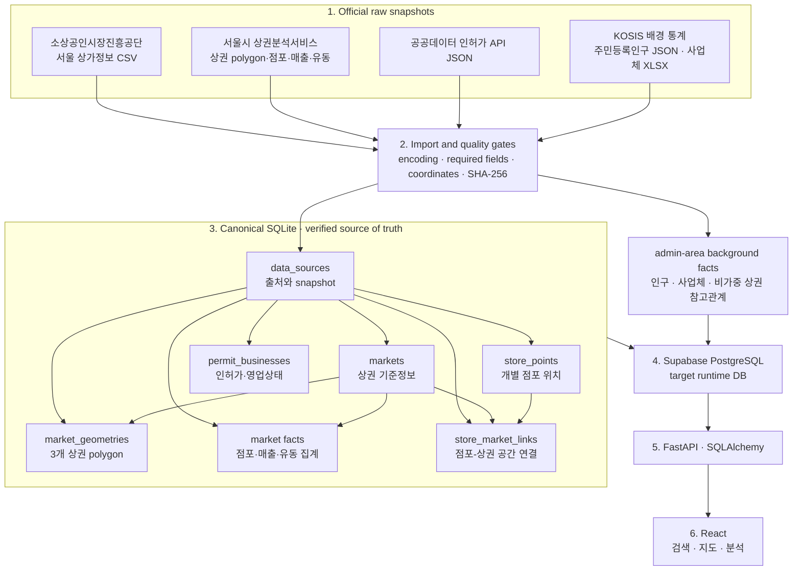
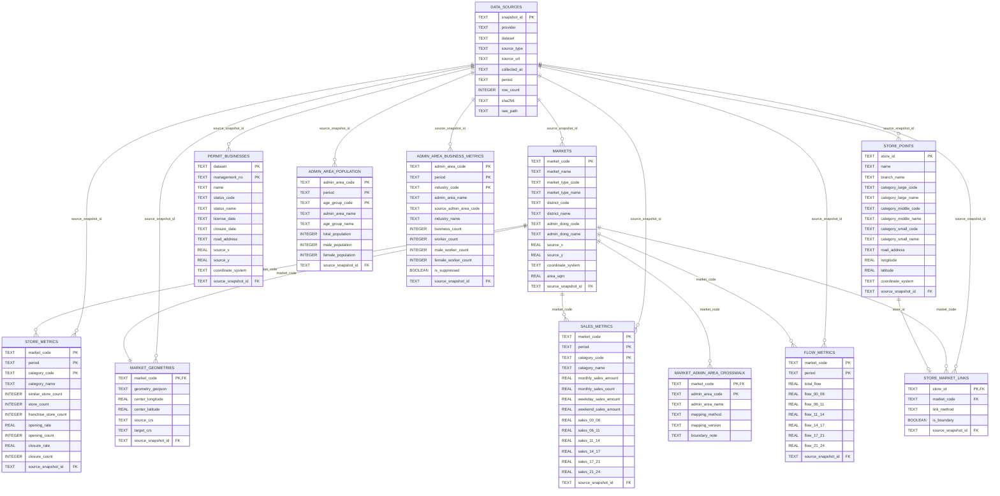
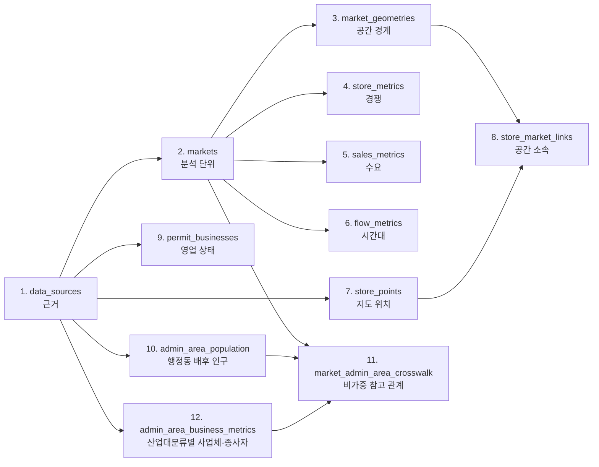
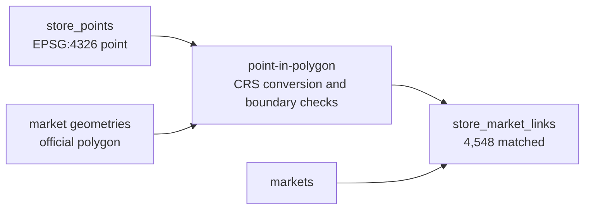

# LocalTwin 데이터베이스 구조

문서 상태: current

문서 기준일: 2026-07-16

이 문서는 LocalTwin의 canonical SQLite와 목표 runtime PostgreSQL의 테이블 관계를 설명하는
DB 구조 원본이다. 데이터가 어디에서 왔는지는 [데이터 소스 매핑](./data-source-mapping.md),
Front·API·DB 전체 연결은 [시스템 아키텍처](../development/architecture.md)를 기준으로 한다.

## 1. 먼저 보는 전체 구조



현재 실제 bulk data는 `product/data/processed/localtwin.db`에 적재됐다. 같은 9개 core table을
정의한 SQLAlchemy model과 Alembic migration을 실제 Supabase PostgreSQL에 적용했다. KOSIS
배경 통계 3개 table은 검증된 raw JSON·XLSX에서 PostgreSQL에 별도로 적재한다. 기존 SQLite 전체
seed는 core 9개 table만 계속 담당하므로 KOSIS 추가가 DB-001 재실행 계약을 바꾸지 않는다.

## 2. 현재 ERD



`PK`는 행을 유일하게 식별하는 Primary Key, `FK`는 다른 table의 행을 가리키는 Foreign
Key다. `STORE_METRICS`, `SALES_METRICS`, `FLOW_METRICS`의 `market_code`는 복합 PK의
일부이면서 `MARKETS.market_code`를 참조하는 FK다. ERD에는 관계선으로 이 이중 역할을
표현했다.

## 3. 위에서 아래로 읽는 순서



1. `data_sources`에서 값의 출처와 기간을 확인한다.
2. `markets`에서 분석 대상 상권을 확인한다.
3. `market_geometries`와 세 metric table에서 공간 경계·경쟁·매출·유동을 확인한다.
4. `store_points`와 `store_market_links`에서 실제 점포 좌표와 검증된 소속 상권을 확인한다.
5. `permit_businesses`에서 인허가와 영업 상태 보강 가능성을 확인한다.
6. `admin_area_population`과 `market_admin_area_crosswalk`에서 행정동 배경 인구와 이를 참고할
   시연 상권을 확인한다. 이 관계는 상권 polygon에 인구를 배분한다는 뜻이 아니다.
7. `admin_area_business_metrics`에서 행정동·산업대분류별 사업체·종사자와 비공개 여부를
   확인한다. 점포 업종 소분류와 자동 결합하지 않는다.

## 4. Table별 역할과 행의 기준

| Table | 한 행의 의미, grain | Primary Key | 주요 Foreign Key | 2026-07-16 development Supabase rows |
| --- | --- | --- | --- | ---: |
| `data_sources` | 한 번 수집한 공식 source snapshot | `snapshot_id` | - | 12 |
| `markets` | 서울시 상권 하나 | `market_code` | `source_snapshot_id` | 1,650 |
| `market_geometries` | 시연 대상 상권의 WGS84 polygon 하나 | `market_code` | `market_code`, `source_snapshot_id` | 3 |
| `store_metrics` | 상권·분기·업종별 점포 집계 | `market_code + period + category_code` | `market_code`, `source_snapshot_id` | 304,775 |
| `sales_metrics` | 상권·분기·업종별 추정매출 | `market_code + period + category_code` | `market_code`, `source_snapshot_id` | 21,427 |
| `flow_metrics` | 상권·분기별 추정 유동인구 | `market_code + period` | `market_code`, `source_snapshot_id` | 1,650 |
| `store_points` | 개별 점포 하나와 대표 좌표 | `store_id` | `source_snapshot_id` | 537,489 |
| `store_market_links` | point-in-polygon으로 확인한 점포의 소속 상권 | `store_id` | `store_id`, `market_code`, `source_snapshot_id` | 4,548 |
| `permit_businesses` | dataset 안의 인허가 사업장 하나 | `dataset + management_no` | `source_snapshot_id` | 40 |
| `admin_area_population` | 행정동·기준월·5세 구간별 총·남·여 주민등록인구 | `admin_area_code + period + age_group_code` | `source_snapshot_id` | 66 |
| `market_admin_area_crosswalk` | 시연 상권이 참고할 행정동 하나 | `market_code + admin_area_code` | `market_code` | 3 |
| `admin_area_business_metrics` | 행정동·연도·산업대분류별 사업체·종사자 | `admin_area_code + period + industry_code` | `source_snapshot_id` | 66 |

행 수는 구조 자체가 아니라 기준일의 적재 상태다. 새 snapshot을 import하면 바뀔 수 있으므로
현재 값은 아래 명령으로 다시 확인한다.

```powershell
uv run --directory product/apps/api python -m localtwin_api.canonical_db --stats
```

### 4.1 같은 schema를 사용하는 환경

- canonical SQLite는 공식 데이터의 정제 결과와 회귀 검증 기준이다.
- 현재 Supabase PostgreSQL은 개발·통합 검증 환경이다.
- KOSIS 배경 통계는 raw snapshot 검증 후 전용 importer로 development Supabase에 추가한다.
- 따라서 SQLite와 PostgreSQL은 core 9개 table을 공유하지만 PostgreSQL에는 배경 통계 3개
  table이 더 있다.
- 운영용 Supabase PostgreSQL은 공개 배포 시 별도 project로 생성한다.
- Alembic revision을 개발용에서 먼저 검증한 뒤 운영용에 같은 순서로 적용한다.
- 개발용과 운영용은 credential과 데이터를 공유하지 않으며, 운영 데이터를 개발 DB로 복사하는 것을 기본값으로 삼지 않는다.

따라서 SQLite에서 성공한 것만으로 운영 배포를 승인하지 않는다. PostgreSQL dialect, FK,
transaction과 API 동작은 development Supabase에서 확인한 뒤 production으로 승격한다.

## 5. 이 관계로 구성한 이유

### 5.1 출처를 한 곳에 보관한다

`data_sources`는 provider, dataset, 기준기간, 원본 상대 경로와 SHA-256을 저장하는 provenance
table이다. 나머지 table은 긴 source metadata를 반복하지 않고 `source_snapshot_id`만
참조한다.


이 구조는 저장 중복을 줄이는 것뿐 아니라 값에서 원본 파일까지 역추적하게 한다.

### 5.2 상권 기준정보와 측정값을 분리한다

`markets`는 상권 이름·행정동·좌표계 같은 dimension이고 세 metric table은 기간에 따라
변하는 fact다. 상권명을 metric 행마다 반복하지 않고 안정적인 `market_code`로 연결한다.

### 5.3 측정 grain이 다른 fact를 합치지 않는다

- 점포와 매출은 `상권 + 분기 + 업종` 단위다.
- 유동인구는 현재 `상권 + 분기` 단위다.
- 세 source는 제공 시점과 결측 조건도 다를 수 있다.

이를 한 table에 합치면 같은 유동인구가 업종마다 반복되고, 일부 source가 없을 때 많은 빈
column이 생긴다. 그래서 `store_metrics`, `sales_metrics`, `flow_metrics`를 분리한다.

### 5.4 근거 없는 연결은 만들지 않는다

`store_points` 원본에는 LocalTwin이 사용하는 서울시 `market_code`가 없다. 그래서 원본 table에
추정 FK를 추가하지 않고, 공식 polygon 안에 포함된 점포만 `store_market_links`에 별도 기록한다.
polygon 밖 점포는 가장 가까운 상권에 강제 귀속하지 않는다. `permit_businesses`도 이름만으로
개별 점포와 연결하면 동명 점포·지점에서 오류가 생기므로 직접 FK를 두지 않았다.

## 6. 현재 공간 관계와 남은 확장

`DATA-009` A단계에서 연남·홍대·합정 polygon을 `EPSG:5181`에서 `EPSG:4326`으로 변환하고
개별 점포를 point-in-polygon으로 연결했다.



현재 결과:

```text
연남 330 / 홍대 3,111 / 합정 1,107
bbox 후보 9,035 / polygon 미포함 4,487 / 경계점 0
```

계속 적용할 원칙:

- polygon 밖 점포를 가장 가까운 상권에 강제 연결하지 않는다.
- 미매칭과 제외 이유를 데이터로 보존한다.
- 실제 출입문이나 facade 방향은 추정하지 않는다.
- 일반·휴게음식점 인허가 전체 pagination 후에만 영업 상태 결합률을 판단한다.
- KOSIS 행정동 통계는 점포 위치가 아닌 배경 수요로 별도 관리한다.

DATA-009 B단계에서는 이 개별 점포 수를 서울시 상권·업종별 공식 집계와 비교해 기준기간과
업종 체계 차이를 보고한다. 서울 전체 polygon 확장은 이 프로젝트 기간의 검색 범위가 아니며,
필요성이 별도로 승인되기 전에는 수행하지 않는다.

### 6.1 KOSIS 행정동 배경 인구

`DATA-010` A단계에서 KOSIS `DT_1B04005N`의 2025년 12월 응답 198행을 snapshot으로
검증하고, 지역·연령별 66행으로 변환해 development Supabase에 적재했다.

```text
서교동 1144066000: 23,500명
합정동 1144068000: 15,629명
연남동 1144071000: 13,782명
```

위 값은 주민등록 상주인구이며 상권 방문자·유동인구·매출을 뜻하지 않는다. 다음 crosswalk는
UI가 참고할 행정동을 선택하기 위한 관계일 뿐 면적 가중치나 인구 배분을 포함하지 않는다.

```text
연남동 골목상권 3110562 -> 연남동 1144071000
홍대입구역 3120103    -> 서교동 1144066000
합정역 3120101        -> 합정동 1144068000
```

같은 snapshot을 두 번 import한 뒤에도 인구 66행과 crosswalk 3행이 유지됐고, source·market
FK orphan, 성별 합계 불일치, 절대경로와 query 포함 source URL은 모두 0건이었다.

### 6.2 전국사업체조사 배경 통계

공식 온라인간행물 2024년 XLSX 84,480 data row에서 세 행정동의 `TOTAL + A~U` 66행만
추출했다. 간행물 구형 지역코드를 현재 행정동 코드로 명시적으로 연결하고, 통계적 비공개 값
`X` 6행은 0으로 바꾸지 않고 `NULL + is_suppressed`로 보존했다.

```text
서교동: 사업체 13,072 / 종사자 62,010
합정동: 사업체 3,816 / 종사자 13,968
연남동: 사업체 3,065 / 종사자 8,850
```

같은 XLSX를 두 번 적재한 뒤에도 66행과 22개 산업코드가 유지됐으며 source FK orphan과
공개된 행의 성별 종사자 합계 불일치는 0건이다.

## 7. 구조를 직접 확인하는 SQL

DB를 연다.

```powershell
uv run --directory product/apps/api python -m sqlite3 "product/data/processed/localtwin.db"
```

전체 table:

```sql
SELECT name AS table_name
FROM sqlite_master
WHERE type = 'table'
  AND name NOT LIKE 'sqlite_%'
ORDER BY name;
```

전체 column:

```sql
SELECT
    m.name AS table_name,
    p.cid AS column_order,
    p.name AS column_name,
    p.type AS data_type,
    p."notnull" AS required,
    p.pk AS primary_key
FROM sqlite_master AS m
JOIN pragma_table_info(m.name) AS p
WHERE m.type = 'table'
  AND m.name NOT LIKE 'sqlite_%'
ORDER BY m.name, p.cid;
```

전체 FK:

```sql
SELECT
    m.name AS child_table,
    fk."from" AS child_column,
    fk."table" AS parent_table,
    fk."to" AS parent_column
FROM sqlite_master AS m
JOIN pragma_foreign_key_list(m.name) AS fk
WHERE m.type = 'table'
ORDER BY m.name, fk.id;
```

출처까지 연결한 점포 sample:

```sql
SELECT
    sp.name,
    sp.category_small_name,
    sp.road_address,
    ds.provider,
    ds.dataset,
    ds.period
FROM store_points AS sp
JOIN store_market_links AS sml
  ON sml.store_id = sp.store_id
JOIN markets AS m
  ON m.market_code = sml.market_code
JOIN data_sources AS ds
  ON ds.snapshot_id = sp.source_snapshot_id
LIMIT 20;
```

## 8. 물리 schema의 실행 원본

| 역할 | 파일 |
| --- | --- |
| canonical SQLite schema와 importer | `product/apps/api/src/localtwin_api/canonical_db.py` |
| bulk CSV importer | `product/apps/api/src/localtwin_api/bulk_import.py` |
| polygon·점포 공간 결합 importer | `product/apps/api/src/localtwin_api/spatial_import.py` |
| PostgreSQL SQLAlchemy model | `product/apps/api/src/localtwin_api/db_models.py` |
| PostgreSQL initial migration | `product/apps/api/alembic/versions/20260715_0001_create_canonical_schema.py` |
| 공간 관계 migration | `product/apps/api/alembic/versions/20260716_0002_add_market_spatial_links.py` |
| KOSIS 배경 통계 migration | `product/apps/api/alembic/versions/20260716_0005_add_admin_area_population.py` |
| 전국사업체조사 migration | `product/apps/api/alembic/versions/20260716_0006_add_admin_area_business_metrics.py` |
| SQLite에서 PostgreSQL로 seed | `product/apps/api/src/localtwin_api/postgres_seed.py` |
| KOSIS snapshot·import | `product/apps/api/src/localtwin_api/kosis_population.py` |
| 전국사업체조사 XLSX snapshot·import | `product/apps/api/src/localtwin_api/kosis_business_census.py` |

문서와 코드가 충돌하면 현재 물리 구조는 schema·migration 코드와 실제 DB introspection으로
확인한다. 구조를 바꿀 때는 SQLite schema, SQLAlchemy model, Alembic migration, seed,
repository test와 이 문서를 같은 Task에서 갱신한다.

## 9. 관련 문서

- [데이터 소스와 canonical field 매핑](./data-source-mapping.md)
- [Front·API·DB 시스템 아키텍처](../development/architecture.md)
- [4주 개발 백로그와 DATA-008·009](../development/tasks.md)
- [상권 분석 기능](../features/market-analysis.md)
- [상권 지도와 핵심 3D Store Marker](../features/market-map-experience.md)
- [개발환경과 DB 실행 명령](../development/environment.md)

## 10. 변경 기록

| 날짜 | 변경 | 이유 |
| --- | --- | --- |
| 2026-07-15 | 7개 canonical table ERD, grain, 관계 이유와 목표 공간 결합 구조 작성 | DB를 위에서 아래로 학습하고 구현 변경 시 같은 구조를 재현하기 위해 |
| 2026-07-15 | 실제 Supabase migration·전체 seed 2회 검증 상태 반영 | canonical SQLite와 제품 runtime PostgreSQL의 현재 상태를 구분하기 위해 |
| 2026-07-15 | development·production Supabase 분리 원칙 추가 | 공개 사용자 데이터와 개발 migration·seed 작업을 격리하기 위해 |
| 2026-07-15 | 3개 상권 polygon과 4,548개 점포 공간 연결, 9개 table ERD 반영 | 실제 검색이 검증된 점포-상권 관계를 사용하도록 하기 위해 |
| 2026-07-16 | KOSIS 행정동 인구 66행과 비가중 crosswalk 3행 반영 | 점포 공간 데이터와 행정동 배경 수요를 섞지 않고 provenance와 함께 제공하기 위해 |
| 2026-07-16 | 전국사업체조사 2024 사업체·종사자 66행 반영 | 공식 XLSX의 구형 지역코드와 비공개 값을 보존하며 업무 배후수요를 보강하기 위해 |
