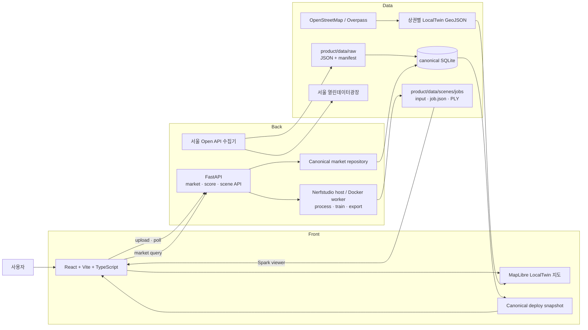
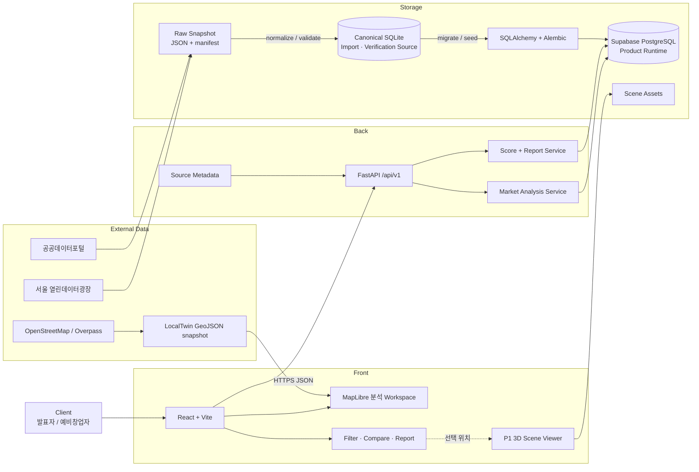

# LocalTwin 시스템 아키텍처

문서 상태: current
최종 갱신: 2026-07-15

이 문서는 LocalTwin의 Front, Back, Data와 외부 서비스가 어떻게 연결되는지 설명하는 아키텍처 원본이다. 구현된 현재 구조와 4주 개발 후 목표 구조를 구분한다.

## 1. 설계 원칙

- 브라우저는 공공데이터 인증키를 직접 사용하지 않는다.
- 원본 데이터, 정규화 데이터와 화면용 응답을 분리한다.
- 상권 분석은 P0, 3D 현장 탐색은 P1로 둔다.
- API는 단일 FastAPI를 유지하고, Phase 2 제품 runtime DB는 Supabase PostgreSQL을 사용한다.
- Phase 1 canonical SQLite는 폐기하지 않고 반복 가능한 import 원본과 결과 검증 기준으로 유지한다.
- 현재 Supabase project는 개발·통합 검증용으로 사용하고, 공개 배포 전에 별도 운영 project를 만든다.
- 분석 결과에는 source, period, unit과 method 근거를 함께 제공한다.

## 2. 현재 구현 구조



현재 확인된 상태:

| 영역  | 구현 상태                                                             | 제한                                            |
| ----- | --------------------------------------------------------------------- | ----------------------------------------------- |
| Front | 자체 지도, 실제 검색 input·상태·선택 흐름과 API/canonical 분석 adapter를 가진 React 웹 | 반경은 아직 지도 탐색 범위이며 공간 재집계 전 |
| Back  | FastAPI market/score/search API, 기본 비활성 Scene API와 Supabase SQLAlchemy repository | 반경별 공간 query와 실제 서비스 배포 미구현 |
| Data  | 537,489개 점포를 포함한 canonical SQLite, 3개 polygon·4,548개 점포 연결, 동일한 개발용 Supabase 9개 table | 운영용 Supabase, 공식 밀집 집계 비교와 주기적 자동 갱신 미구현 |
| 3D    | 촬영물 job, host/Docker worker, Nerfstudio pipeline과 Spark viewer | 공식 sample 학습·export·viewer만 검증됨. 사용자 촬영물과 privacy gate 미검증 |

## 3. Phase 2 목표 구조



## 4. 요청과 데이터 흐름

### 4.1 데이터 준비

```text
공식 API/File
-> provider별 raw snapshot과 manifest 저장
-> 주소·좌표·업종·기간 정규화
-> canonical schema 품질 검사
-> canonical SQLite 적재와 기준 row count 검증
-> Alembic schema가 적용된 Supabase PostgreSQL에 migrate/seed
```

### 4.2 사용자 분석 요청

```text
상권명·점포명·주소·업종 검색
-> React가 GET /api/v1/search 호출
-> Supabase에서 3개 지원 상권과 공간 결합 점포 조회
-> 결과 ID·좌표·소속 상권을 지도와 분석 state에 반영
-> React가 상권 분석 endpoint 호출
-> DB에서 대상 점포와 지표 조회
-> 경쟁·변화·시간대·입지 점수 계산
-> source metadata를 포함한 JSON 응답
-> 지도, 비교표와 리포트 갱신
```

### 4.3 보조 3D 탐색

```text
지도에서 선택 위치 상세보기
-> 360 영상·사진 upload와 hash 검증
-> worker readiness 확인
-> ns-process-data -> ns-train splatfacto -> ns-export
-> PLY asset을 Spark/Three.js로 로드
-> 10시 / 13시 / 15시 / 18시 관찰 metadata 선택
```

원본과 job은 브라우저 정적 bundle이 아니라 API의 scene storage에 둔다. 익명화 검증 전 asset은 외부 공개 대상으로 취급하지 않는다.

## 5. 기술 스택과 도입 상태

| 계층     | 현재 사용                                       | Phase 2 목표                               | 후속 후보                                   |
| -------- | ----------------------------------------------- | ------------------------------------------- | ----------------------------------------------- |
| Front    | React, Vite, TypeScript, MapLibre, 실제 검색과 API/snapshot 분석 adapter | 반경 query·filter URL 동기화와 source-aware 상태 확장 | 대규모 Layer가 필요할 때 deck.gl 검토           |
| Back     | FastAPI market/score/search/scene endpoint, Uvicorn, SQLAlchemy repository | 반경 API와 service 배포 | 부하가 확인된 뒤 worker/cache 검토 |
| Data     | raw manifest, 9개 table canonical SQLite, SQLAlchemy/Alembic, 3개 상권 공간 관계를 가진 개발용 Supabase | 공식 밀집 비교와 공개 배포 전 운영용 Supabase 승격 | 다지역 공간 질의가 필요할 때 PostGIS 검토 |
| Analysis | score 1.0.0과 실제 DB peer percentile          | 추가 지표로 confidence coverage 개선       | 충분한 데이터 이후 예측 모델 검토               |
| 3D       | upload/job API, Nerfstudio pipeline, Spark/Three.js viewer | CUDA worker에서 실제 scene 1개 학습·익명화 검증 | 혼잡도 mesh overlay와 pipeline 고도화           |
| Quality  | pytest, Vitest, TypeScript, lint, 문서 검사     | 평가 script와 시연 smoke test               | 필요 시 E2E 자동화                              |

## 6. 배포 구조

```text
ARCH-002 적용 후
  product/      실제 서비스 source와 제품 배포 artifact
  docs/         개발·결정·검증 문서 source와 별도 문서 배포 artifact
  두 artifact는 서로의 내부 파일을 복사하거나 함께 배포하지 않음

Product runtime
  React -> FastAPI -> Supabase PostgreSQL

Import/verification
  official snapshots -> canonical SQLite -> migration/seed -> PostgreSQL
```

### 6.1 DB 환경 분리 결정

현재 생성하고 전체 seed를 검증한 Supabase project는 `development` 환경이다. 공개 사용자의
데이터를 받는 운영 DB는 아직 만들지 않았다. 공개 배포 Gate에서 별도의 `production`
Supabase project를 만들고, 개발 환경에서 검증된 Alembic revision과 seed 절차만 동일하게
적용한다.

```text
canonical SQLite
  공식 snapshot 정제 · import 원본 · row count 회귀 기준
        |
        v
development Supabase (현재 존재)
  migration · seed · FastAPI/React 통합 · smoke test
        |
        v  검증된 migration과 seed 절차만 승격
production Supabase (공개 배포 시 생성)
  실제 배포 API 전용 runtime DB
```

분리 이유:

- 개발 중 schema 변경, 재seed와 테스트 데이터가 실제 사용자 데이터에 영향을 주지 않는다.
- 운영 DB credential을 개발 PC·브라우저·일상적인 테스트 명령에서 분리한다.
- 개발 환경에서 migration, rollback 계획과 API 회귀를 확인한 뒤 운영에 forward migration만 적용한다.
- 장애가 발생하면 개발용 DB를 계속 수정하는 대신 검증된 revision과 배포 단위로 원인을 추적할 수 있다.

SQLite와 Supabase를 각각 개발·운영 DB로 나누는 구조는 아니다. SQLite는 데이터 pipeline의
canonical 기준이고, 실제 서비스 동작은 PostgreSQL과 같은 특성을 가진 개발용 Supabase에서
먼저 검증한다. 환경별 URL·password·key는 서로 공유하지 않는다.

제품은 `product/vercel.json`에서 `product/apps/web/dist`만 배포하고, 문서는 루트 `vercel.json`에서 `dist/docs-site`만 배포한다. 루트 `.vercelignore`는 Vercel source upload를 `docs/`, 문서 build script, `package.json`, `vercel.json`으로 제한한다. 따라서 ignored raw data, canonical DB, Scene asset과 제품 source는 build 이전 upload 단계에도 포함하지 않는다. 제품의 Docs 링크는 `VITE_DOCS_URL` 또는 현재 문서 URL을 사용하므로 같은 artifact의 `/docs`에 의존하지 않는다. 공공데이터 인증키와 수집기는 브라우저 bundle에 넣지 않으며 Scene route는 SEC-001의 제품 기본 차단을 유지한다. 실제 공개 제품 URL 생성은 별도 배포 Task에서 수행한다.

## 7. 이번 구조에서 하지 않는 것

- Eureka, API Gateway, Microservice 분할
- Redis와 Elasticsearch 선도입
- 실시간 영상 스트리밍
- 브라우저에서 provider API 직접 호출
- 서울 전체 검색과 도시 전체 3D reconstruction

첨부 예시처럼 Front와 Back의 책임은 분리하되, 프로토타입 규모에 필요하지 않은 분산 시스템 구성은 넣지 않는다.

## 8. 관련 문서

- [4주 개발 백로그](./tasks.md)
- [개발환경](./environment.md)
- [개발 컨벤션](./conventions.md)
- [데이터베이스 구조와 ERD](../data/database-structure.md)
- [데이터 소스 매핑](../data/data-source-mapping.md)
- [공공데이터 기반 상권 분석](../features/market-analysis.md)
- [상권 지도, 2.5D 건물과 핵심 3D Store Marker](../features/market-map-experience.md)

## 9. 변경 기록

| 날짜       | 변경                                         | 이유                                                       |
| ---------- | -------------------------------------------- | ---------------------------------------------------------- |
| 2026-07-10 | 현재 구조와 4주 목표 구조를 분리해 최초 작성 | 구현된 기능과 계획을 같은 구조도로 오해하지 않게 하기 위해 |
| 2026-07-11 | scene job API, Nerfstudio worker와 Spark viewer 반영 | 구현 코드와 실제 GPU 제약을 구조에 함께 표시하기 위해 |
| 2026-07-11 | canonical market API와 Front fallback 반영 | 로컬 API와 정적 배포의 실제 데이터 경로를 구분하기 위해 |
| 2026-07-11 | Docker scene worker와 renderer QA 반영 | worker 재현성과 실제 capture 미검증을 구분하기 위해 |
| 2026-07-13 | Phase 2 runtime DB와 제품·문서 배포 경계 확정 | SQLite를 이관 원본으로 유지하면서 실제 서비스 구조로 전환하기 위해 |
| 2026-07-14 | 제품·문서 물리 source와 배포 artifact 분리 | 제품 build에서 내부 문서를 제거하고 문서 build에서 제품 source를 제외하기 위해 |
| 2026-07-15 | 문서 Vercel source upload allowlist 추가 | 로컬 raw data와 Scene asset이 문서 build 전 upload 대상에 포함되지 않게 하기 위해 |
| 2026-07-15 | bulk canonical data와 PostgreSQL local 전환 경로 반영 | 실제 Supabase 적용 전 로컬 구현과 운영 완료를 구분하기 위해 |
| 2026-07-15 | 개발용·운영용 Supabase project 분리 결정 | schema·seed 검증이 공개 사용자 데이터와 credential에 영향을 주지 않게 하기 위해 |
| 2026-07-15 | 3개 상권 공간 결합과 Supabase 검색 API·React 연결 | 실제 점포 검색에서 지도·분석 화면까지 최소 vertical slice를 완성하기 위해 |
