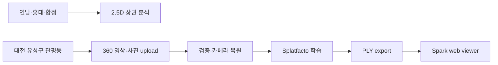
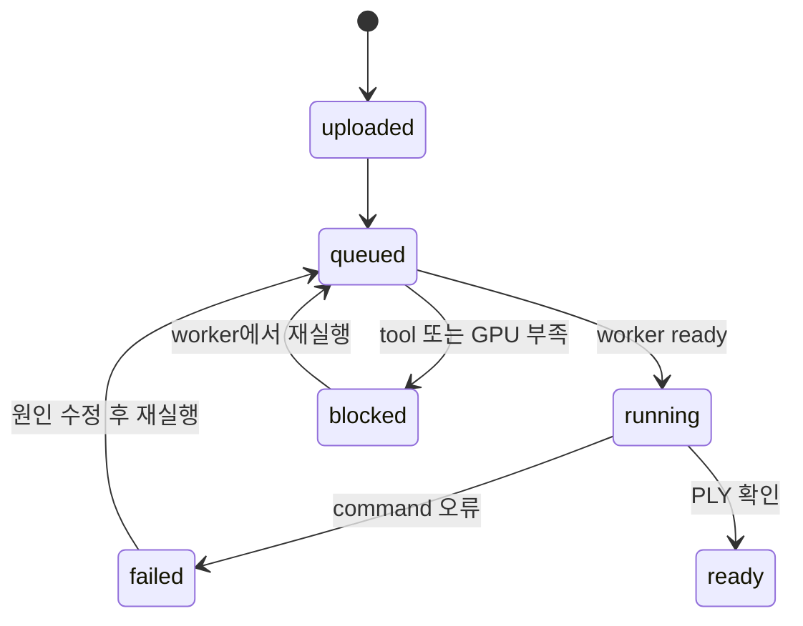

# 기능 스펙: Gaussian Splatting 현장 상세보기

## 1. 기능 구분

```text
구분: 보조/추가기능
우선순위: P1
상태: upload/job/viewer와 공식 sample 3DGS 학습·export 검증, 사용자 촬영 E2E·익명화 미검증
대상: 대전 유성구 관평동 한 장소
```

이 기능은 LocalTwin의 주기능이 아니다. 상권 지도에서 선택한 위치를 사람이 현장에 서 있는 눈높이로 확인하고, 시간대별 혼잡도를 공간 안에서 체감하도록 돕는 보조 기능이다.

## 2. 목표

```text
한 가게 앞 또는 거리 10~20m를 Gaussian Splatting으로 복원하고,
사람 눈높이의 현장 시점에서 시간대별 예상 혼잡도를 확인한다.
```

현장 상세보기는 상권 전체를 내려다보는 2.5D 지도와 별도 화면이다.



```text
2.5D 상권 지도:
상권 전체의 점포, 경쟁, 인구와 매출 분포 비교

현장 상세보기:
선택한 한 위치에 실제로 서 있을 때의 공간과 체감 혼잡도 확인
```

## 3. 핵심 원칙

```text
서비스는 원본 영상을 보여주지 않는다.
서비스는 직접 촬영한 이미지로 생성한 정적인 3DGS 장면을 보여준다.
3D 복원용 촬영과 시간대별 혼잡도 관찰은 분리한다.
모든 시간대 영상을 3D 복원 입력으로 섞지 않는다.
촬영된 실제 사람과 통계 기반 사람 오브젝트를 구분한다.
통계 기반 사람 오브젝트를 실제 개인 위치나 이동 경로처럼 표현하지 않는다.
```

## 4. 사용자 흐름

```text
1. 사용자가 2.5D 상권 지도에서 가게 또는 촬영 지점을 선택한다.
2. 현장 상세보기를 실행한다.
3. 사람 눈높이의 초기 camera에서 3DGS 장면을 확인한다.
4. 제한된 범위 안에서 주변을 회전하거나 이동한다.
5. 10시 / 13시 / 15시 / 18시 중 하나를 선택한다.
6. 선택한 시간대의 예상 혼잡도가 추상적 사람 오브젝트 수와 분포로 표현된다.
7. 실제 집계값, 데이터 성격과 출처를 정보 panel에서 확인한다.
```

## 5. 입력

### A. 3D 복원용 입력

```text
사람이 적은 시간에 1회 촬영
가게 앞 또는 거리 10~20m
3~5분 영상 또는 충분히 겹치는 사진
```

복원용 촬영의 목적은 시간대별 사람을 기록하는 것이 아니라 깨끗한 배경 공간을 만드는 것이다.

### B. 혼잡도 입력

```text
10:00 오전 유동
13:00 점심 이후
15:00 오후 카페/체류
18:00 퇴근/저녁
```

사용 가능한 데이터:

```text
공공 유동인구 집계
직접 관찰값
수동으로 입력한 혼잡도
개발용 fixture
```

데이터마다 `source_type`과 기준 시점을 저장하고 화면에 표시한다.

## 6. 처리 흐름

### 6.1 배경 장면 생성

```text
3D 복원용 촬영
→ 프레임 추출
→ 흐림과 흔들림이 심한 프레임 제외
→ 실제 사람 영역 탐지
→ blur / mask / frame exclude
→ 정제 이미지로 Gaussian Splatting 생성
→ 웹 3DGS viewer에 장면 로드
```

현재 자동화된 명령 경계는 다음과 같다.

```text
ns-process-data images|video
-> ns-train splatfacto
-> ns-export gaussian-splat
```

사용자가 입력한 값은 shell 문자열로 조합하지 않고 고정된 argument list에만 전달한다. 각 job은 `product/data/scenes/jobs/<uuid>`에 입력 hash, 크기, stage 상태와 실행 log를 분리해 저장한다.



API 계약:

| Method | Path | 역할 |
| --- | --- | --- |
| `GET` | `/api/v1/scenes/toolchain` | FFmpeg, Nerfstudio와 CUDA worker 상태 확인 |
| `POST` | `/api/v1/scenes/jobs` | 촬영물 저장, 검증과 자동 실행 예약 |
| `GET` | `/api/v1/scenes/jobs/{id}` | job과 네 단계 상태 조회 |
| `POST` | `/api/v1/scenes/jobs/{id}/run` | worker 준비 후 재실행 |
| `GET` | `/api/v1/scenes/jobs/{id}/asset` | 준비된 `scene.ply` 제공 |

### 6.2 현장 좌표 설정

3DGS 장면의 좌표계 안에 다음 기준을 수동 또는 반자동으로 설정한다.

```text
초기 camera 위치
눈높이
이동 가능 범위
가게 marker 위치
사람이 설 수 있는 walkable zone
사람을 배치하지 않는 excluded zone
```

v0.1에서는 보도, 가게 앞과 골목 통로를 관리자가 직접 Polygon 또는 path로 지정하는 방식을 허용한다.

### 6.3 예상 혼잡도 표현

```text
시간대별 FlowObservation
→ 값의 단위와 공간 범위 확인
→ 장면 표시용 혼잡도 단계로 변환
→ walkable zone에 사람 오브젝트 배치
→ 정보 panel에 원래 집계값과 출처 표시
```

## 7. 장면 구성

```text
배경:
직접 촬영한 Gaussian Splatting 장면

전경:
통계 기반의 단순한 사람 3D 오브젝트

정보:
가게 marker, 시간대 control, 혼잡도와 데이터 출처 panel
```

### 초기 Camera

```text
높이: 사람 눈높이에 가까운 값
위치: 실제 촬영 지점 또는 보도
방향: 기준 가게와 주변 골목이 보이는 방향
이동: 장면 품질이 확보된 제한 범위
```

눈높이는 장면 scale을 보정한 뒤 정한다. 모든 장면에 무조건 같은 좌표값을 적용하지 않는다.

## 8. 통계 기반 사람 오브젝트

### 시각 스타일

사람은 현실적인 외모로 만들 필요가 없다.

```text
low-poly 사람
단색 silhouette
게임 말과 비슷한 추상적 캐릭터
```

실제 촬영 공간은 현실적으로 보이되 예상 인구는 단순화하여 둘을 시각적으로 구분한다.

### 배치 규칙

```text
walkable zone 안에만 배치
오브젝트 사이 최소 거리 적용
가게 입구와 보도의 가중치 적용 가능
차도, 화단, 차량과 건물 내부는 제외
같은 시간대에는 고정된 seed 사용
```

같은 시간대를 다시 선택했을 때 위치가 매번 완전히 바뀌지 않게 한다.

### 표시 개수

화면의 사람 오브젝트 수는 실제 사람 수와 동일하지 않을 수 있다.

예시:

| 시간대 | 원본 혼잡도 | 장면 표시 |
| ------ | ----------- | --------- |
| 10시   | 낮음        | 5개       |
| 13시   | 높음        | 18개      |
| 15시   | 보통        | 11개      |
| 18시   | 매우 높음   | 24개      |

표기 예시:

```text
예상 유동인구: 약 3,200명/시간
장면의 사람 오브젝트는 혼잡도를 체감하기 위한 시각적 표본입니다.
```

절대 인구 단위가 없는 경우에는 사람 수를 추정하지 않고 혼잡도 지수로 표시한다.

### 움직임

이동 방향 데이터가 없으면 실제 보행 경로처럼 움직이게 하지 않는다.

허용할 수 있는 연출:

```text
idle animation
작은 방향 전환
시간대 전환 시 fade in / fade out
미세한 제자리 움직임
```

출발지·도착지 또는 이동 방향 데이터가 확보된 경우에만 연속적인 flow animation을 별도 검토한다.

## 9. 렌더링 구조

웹은 Three.js와 Spark `SplatMesh`를 lazy-load한다. asset이 준비된 job에서만 renderer bundle을 내려받으며, OrbitControls로 회전·확대·축소한다.

```text
Scene PLY endpoint
-> SparkRenderer + SplatMesh
-> Three.js PerspectiveCamera
-> OrbitControls
```

renderer는 loading/error canvas mount를 React 상태와 분리하고, 준비된 asset의 splat count와 bounds를 진단 metadata로 남긴다. synthetic binary Gaussian PLY 330개를 사용한 QA에서는 desktop canvas의 26.43%가 배경과 다른 pixel이었고, 390px mobile에서도 nonblank와 가로 overflow 없음을 확인했다. 이 결과는 renderer 검증이며 실제 촬영 복원 품질 검증이 아니다.

실제 GPU 검증에서는 Nerfstudio 공식 `storefront` 다중 시점 사진을 P100 16GB worker에서 학습했다. 최종 checkpoint step `12999`에서 537,977 splat, 133,419,827-byte PLY를 export했고 server/local SHA-256이 일치했다. viewer는 Nerfstudio camera pose를 복원하고 scale 상위 outlier 1,153개만 화면에서 숨겨 첫 촬영 사진과 같은 벽돌 상점 전면을 표시했다. 자세한 절차와 수치는 [GPU Scene Validation](../operations/gpu-scene-validation.md)에 기록한다.

### Worker mode

```text
SCENE_WORKER_MODE=host
또는
SCENE_WORKER_MODE=docker
SCENE_DOCKER_IMAGE=ghcr.io/nerfstudio-project/nerfstudio:1.1.5
```

Docker mode는 job directory만 `/workspace`에 mount하고 `--gpus all --shm-size=12gb`로 고정된 Nerfstudio argument list를 실행한다. host에 `ns-*` 도구가 없어도 되지만 Docker, NVIDIA driver, image와 최소 6000MB VRAM은 필요하다.

`deck.gl`은 현장 상세보기의 기본 기술이 아니다. 현장 사람 오브젝트는 지도 Layer가 아니라 3DGS 장면의 local coordinate 안에서 렌더링한다.

PoC에서 검증해야 할 핵심:

```text
3DGS 장면 scale과 사람 model scale 정렬
camera 좌표와 walkable zone 좌표 정렬
Gaussian Splat과 mesh 사이의 depth/occlusion
모바일 GPU 성능과 memory 사용량
사람 오브젝트 수가 장면 품질에 미치는 영향
```

## 10. 출력

```text
사람 눈높이의 정적 3DGS 현장
가게 또는 관찰 지점 marker
현장 정보 panel
10시 / 13시 / 15시 / 18시 segmented control
시간대별 예상 혼잡도
통계 기반의 추상적 사람 오브젝트
데이터 출처와 시각화 의미 설명
```

좌석 수, 영업시간과 같은 점포 정보는 출처가 확인된 경우에만 정보 panel에 표시한다.

## 11. 완료 기준

```text
한 가게 앞 또는 거리 10~20m의 3DGS 장면을 웹에서 열 수 있다.
사람 눈높이에 가까운 초기 camera에서 장면을 확인할 수 있다.
장면의 제한된 범위에서 회전 또는 이동할 수 있다.
가게 marker를 선택하고 정보 panel을 열 수 있다.
10시 / 13시 / 15시 / 18시 데이터를 전환할 수 있다.
시간대에 따라 추상적 사람 오브젝트 수 또는 분포가 달라진다.
오브젝트가 walkable zone 밖에 배치되지 않는다.
실제 집계값과 장면 표시용 오브젝트의 의미를 구분해 표시한다.
원본 영상과 식별 가능한 촬영 인물을 서비스 화면에 노출하지 않는다.
```

## 12. 제외 범위

```text
AR
실시간 영상 스트리밍
실시간 개인 추적
도시 전체 3D 복원
여러 상권 동시 3D 복원
현실적인 군중 simulation
근거 없는 보행 경로 생성
정확한 물리 충돌과 측정 도구
모든 시간대 영상을 3D 복원 입력으로 사용
```

## 13. 현재 프로토타입 상태

2026-07-15 기준 지도 화면에서 `관평동 3D 장소`를 열어 다음 기능을 조작할 수 있다.

```text
촬영 대상: 대전 유성구 관평동 한 장소
촬영 범위: 점포 전면과 보도 약 10~20m
대표 관찰 시간: 10:00 / 13:00 / 15:00 / 18:00
입력: 360 영상·사진, 일반 영상·사진 묶음
진행 상태: 입력 검증 → 카메라 복원 → Splatfacto 학습 → PLY export
worker 상태: GPU 이름·VRAM·필수 tool과 blocked reason 표시
privacy gate: 원본 비공개, 얼굴·차량번호 등 식별 영역 제외
```

upload와 job 상태는 실제 API를 사용하며, PLY가 준비되면 Spark viewer를 연다. 로컬 PC의 `NVIDIA GeForce MX450 2048MB`에서는 학습이 차단되지만, 원격 P100 16GB worker에서 Nerfstudio 공식 `storefront` 다중 시점 사진을 step `12999`까지 학습하고 537,977 splat PLY export·SHA-256 일치·desktop/mobile viewer를 검증했다. 이 결과는 공식 sample pipeline의 증거이며 사용자 촬영 360 영상·사진, 얼굴·차량번호 익명화와 서버 privacy gate 완료 증거는 아니다. 관평동은 연남·홍대·합정 상권 비교 목록에도 포함하지 않는다.

## 14. 관련 문서

- [상권 지도, 2.5D 건물과 핵심 3D Store Marker](./market-map-experience.md)
- [사람 영역 익명화 전처리](./person-anonymization-preprocessing.md)
- [공공데이터 기반 상권 분석](./market-analysis.md)
- [LocalTwin 디자인 시스템](../design/design-system.md)
- [데이터 소스 매핑](../data/data-source-mapping.md)
