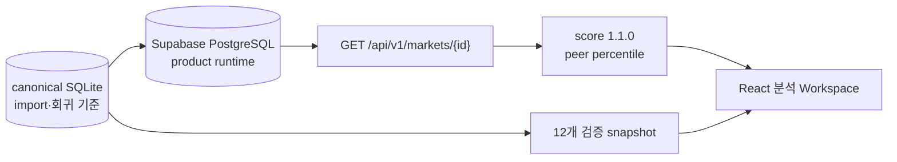

# 기능 스펙: 공공데이터 기반 상권 분석

## 1. 기능 구분

```text
구분: 주기능
우선순위: P0
```

LocalTwin의 핵심 기능이다. 사용자는 특정 상권을 기준으로 인구, 매출, 경쟁, 개폐업, 영업 안정성과 시간대별 특성을 확인한다.

모든 지표를 v0.1 필수 범위로 간주하지 않는다. 실제 데이터 필드와 이용 조건을 검증한 뒤 `필수 지표`와 `조건부 지표`를 구분한다.

## 2. 목표

```text
예비창업자 또는 소상공인이 특정 상권의 수요, 경쟁과 영업 안정성을
데이터 출처와 함께 빠르게 이해할 수 있게 한다.
```

LocalTwin은 창업 성공을 예측하는 서비스가 아니다. 공공데이터와 제한된 관찰값을 바탕으로 후보 상권을 비교하고 해석하는 분석 도구다.

## 3. 입력과 Filter

### 기본 입력

```text
분석 대상 상권
분석 중심 위치 또는 가게 위치
분석 반경: 100m / 300m / 500m
대상 업종
조회 기간
```

### 조건부 Filter

데이터가 해당 차원을 제공할 때만 노출한다.

```text
요일
시간대
성별
주거인구 / 유동인구
매출 유형
```

성별 filter는 `주거인구 성별`과 `유동인구 성별`을 구분해야 한다.

## 4. 분석 영역

### 4.1 인구와 수요

| 지표 | 의미 | 주의사항 |
| --- | --- | --- |
| 남성/여성 구성 | 성별 인구 비율 | 주거인구인지 유동인구인지 명시 |
| 주거인구 | 해당 지역에 거주하는 인구 | 생활권 수요의 참고값 |
| 유동인구 | 특정 시간에 지역에 존재하거나 이동하는 인구 | 실제 보행량인지 추정 생활인구인지 구분 |
| 시간대별 인구 | 시간대별 수요 변화 | 집계 시간과 공간 단위 표시 |
| 요일별 인구 | 평일/주말 및 요일별 차이 | 동일 기간 기준으로 비교 |

### 4.2 매출

| 지표 | 의미 | 주의사항 |
| --- | --- | --- |
| 카드매출 | 카드 소비 기반 매출 또는 추정값 | 제공기관, 추정 여부와 이용 조건 확인 |
| 지역별 매출 순위 | 동일 비교 집합 안의 상대 순위 | 지역, 업종과 기간을 함께 표시 |
| 업종별 매출 | 업종 단위 매출 규모 | 표본과 비식별 처리 기준 확인 |
| 요일별 매출 | 요일에 따른 소비 변화 | 유동인구 그래프와 구분 |
| 시간대별 매출 | 시간대에 따른 소비 변화 | 유동인구 그래프와 구분 |

카드매출 데이터가 확보되지 않으면 매출 지표를 fixture로 실제 서비스처럼 노출하지 않는다. 기능을 숨기거나 `데이터 준비 중` 상태로 표시한다.

### 4.3 경쟁과 업종

| 지표 | 계산 |
| --- | --- |
| 업종 분포 | 전체 점포 중 업종별 점포 수와 비율 |
| 동일 업종 수 | 선택 반경 안의 동일 업종 점포 수 |
| 업종 밀도 | 동일 업종 점포 수 / 분석 면적 |
| 경쟁 강도 | 동일 업종 수, 밀도와 수요를 조합한 설명 가능한 규칙 |

업종 filter는 원본 데이터가 아니라 화면 기능이다. 원천 업종 코드를 canonical category로 정규화한 뒤 filter에 사용한다.

### 4.4 개폐업과 영업 안정성

| 지표 | 정의 |
| --- | --- |
| 개업 현황 | 기간별 신규 인허가 또는 영업 시작 점포 수 |
| 폐업 현황 | 기간별 폐업 점포 수 |
| 순증감 | 개업 수 - 폐업 수 |
| 현재 영업기간 | 현재 영업 중인 점포의 기준일 - 개업일 |
| 폐업 점포 영업기간 | 폐업일 - 개업일 |
| 신생기업 생존율 | 같은 개업 cohort 중 N개월 뒤 영업 중인 점포 비율 |

현재 영업 중인 점포와 이미 폐업한 점포의 영업기간을 하나의 평균으로 섞지 않는다.

신생기업 생존율:

```text
생존율(N개월)
= N개월 뒤 영업 중인 cohort 점포 수
/ 기준 기간에 개업한 전체 cohort 점포 수
```

다음 값을 함께 표시한다.

```text
cohort 개업 기간
생존 판정 기간 N개월
표본 점포 수
대상 지역과 업종
영업 상태 판정 기준
```

## 5. 지도 출력

상권 지도에서 다음 Layer를 제공한다.

```text
2.5D 건물과 점포 marker
분석 반경
유동인구
주거인구
매출 수준
업종 분포
개폐업 변화
```

사용자는 유동인구 등 분석 Layer를 켜고 끌 수 있다. 지도 위 symbol은 집계값의 시각적 표현이며 실제 개인 위치를 의미하지 않는다.

상세 구현은 [상권 지도, 2.5D 건물과 핵심 3D Store Marker](./market-map-experience.md)를 따른다.

## 6. 분석 Panel

```text
인구 특성
매출 현황
경쟁 현황
영업 안정성
요일별 분석
시간대별 분석
종합분석
```

요일별 분석과 시간대별 분석에서는 대상 metric을 제목에 포함한다.

```text
요일별 유동인구
요일별 카드매출
시간대별 유동인구
시간대별 카드매출
```

`요일별 분석`, `시간대별 분석`처럼 대상이 없는 제목만 사용하지 않는다.

## 7. 점포 상세 정보

공공데이터 기반:

```text
점포명
업종
주소
좌표
인허가일
영업 상태
주변 경쟁 점포 수
```

별도 조사 또는 점포 제공값:

```text
좌석 수
영업시간
현장 사진
직접 관찰 혼잡도
현장 3D scene 연결
```

좌석 수는 공공 상권·인허가 데이터에서 자동으로 얻는 값으로 가정하지 않는다.

```json
{
  "seat_count": 46,
  "seat_count_type": "observed",
  "observed_at": "2026-07-09"
}
```

확인하지 못했다면 숫자를 추정하지 않고 `좌석 정보 없음`으로 표시한다.

## 8. 입지 점수 v0.1

v0.1은 설명 가능한 규칙 기반 점수로 시작한다. 공식 1.0.0의 계산식, peer group, 누락값 처리, 신뢰도와 특수상권 보정은 [LocalTwin 상권 점수 공식](./market-score-methodology.md)을 단일 기준으로 사용한다.

```text
입지 점수
= 수요 점수
+ 경쟁 점수
+ 변화 점수
+ 영업 안정성 점수
+ 시간대 점수
```

| 항목 | 데이터 |
| --- | --- |
| 수요 점수 | 주거인구, 생활인구 또는 유동인구 |
| 경쟁 점수 | 동일 업종 점포 수, 업종 밀도 |
| 변화 점수 | 개업, 폐업과 순증감 |
| 영업 안정성 점수 | 영업기간, 조건이 충족되면 생존율 |
| 시간대 점수 | 10시 / 13시 / 15시 / 18시 인구 또는 관찰값 |

매출 데이터가 검증된 경우에만 별도 매출 점수 또는 종합분석 근거로 추가한다.

동일 업종 밀집은 기본적으로 경쟁 압력으로 보되 무조건 감점하지 않는다. LQ가 높고 점포당 매출·유동 수요·생존 근거가 함께 좋은 경우에는 생산적 집적상권으로 제한된 가점을 주고, 매출 희석 또는 높은 폐업률이 동반되면 과포화 감점을 적용한다.

## 9. 종합분석

종합분석은 LLM이 원천 데이터를 임의로 판단하는 방식으로 만들지 않는다.

```text
Canonical data
→ 정의된 지표 계산
→ 규칙 기반 점수와 근거 생성
→ Template report
→ 선택적으로 LLM이 문장으로 해석
```

종합분석 출력:

```text
주요 수요 특성
경쟁 수준
최근 개폐업 변화
영업 안정성
강한 요일과 시간대
위험 요인
데이터 한계
```

LLM 출력에도 사용한 데이터의 기간, 출처와 추정 여부를 함께 전달한다.

## 10. 데이터 출처 표시

모든 주요 metric은 다음 metadata와 연결한다.

```json
{
  "metric": "floating_population",
  "value": 3240,
  "unit": "people_per_hour",
  "area_id": "market-001",
  "period": "2026-06",
  "time_slot": "13:00",
  "source_name": "서울시 열린데이터광장",
  "source_url": "https://example.com",
  "source_type": "official_estimate",
  "updated_at": "2026-07-01",
  "method": "원본 집계값"
}
```

필수 화면 표기:

```text
출처
기준 기간
공간 집계 단위
갱신일
공공데이터 / 추정값 / 직접 관찰 / fixture 구분
```

표기 예시:

```text
출처: 서울시 열린데이터광장
기준: 2026년 6월, 행정동 단위
성격: 통신데이터 기반 추정 생활인구
```

### 현재 API와 화면 연결

2026-07-16 기준 다음 흐름이 실제 구현됐다.



```text
지원 상권: 연트럴파크(연남동주민센터), 홍대입구역(홍대), 합정역
지원 업종: 카페, 음식점, 베이커리, 편의점
실제 지표: 점포 수, 개폐업, 추정매출, 길단위인구 6개 시간대
화면: API 우선, API 데이터 조회 실패는 명시하고 같은 canonical 기준의 snapshot 예시를 구분 표시
```

현재 score는 사용 가능한 5개 지표만 사용하므로 coverage와 confidence가 낮을 수 있다. 이 경우 화면에 `신뢰도 낮음`을 그대로 표시한다.

`점수 산정 근거`에서는 총점만 반복하지 않고 현재 판정, confidence, 생산적 집적·특화 판단 보류·과포화 후보, 긍정·주의 근거, source와 누락 지표를 함께 표시한다.

중요한 공간 단위:

```text
우측 분석 지표: 서울시 상권 경계
지도 100m/300m/500m: 현재 탐색·표시 범위
```

반경 selector가 아직 서울시 상권 집계를 원형 반경으로 다시 계산하지는 않는다. 개별 점포 목록은 OSM POI이며 점포별 성공 점수 대신 `POI`로 구분한다.

### Phase 2 저장소와 검색 경계

분석·검색·반경 API는 동일한 SQLAlchemy session을 통해 product runtime PostgreSQL을
조회한다. canonical SQLite는 API runtime에서 직접 열지 않고, PostgreSQL에 이관할 공식
데이터의 기준과 row count·응답 회귀 검증 원본으로 유지한다.

첫 검색 vertical slice는 서울 전체 검색이 아니다. 연남·홍대·합정 polygon 안에 연결된 실제
점포에서 이름·주소·업종 query를 받아 결과를 선택하고 기존 핵심 분석 화면을 연다. 현재
`FE 구조 분리 → DB migration/seed → 검색 API contract → React 연결`까지 완료했고,
`반경 query → filter·URL 동기화`를 현재 스프린트 마감 뒤 `ANALYSIS-002` Task로 진행한다.

후속 반경 정책:

```text
최소/최대: 100m / 500m
기본값: 300m
첫 선택지: 100m / 300m / 500m
지원 중심: 연남·홍대·합정 polygon 내부
조회 시점: 지도 이동 중이 아니라 `이 위치에서 검색` 확정 시 1회
```

기본 지도 탐색은 확정된 분석 중심을 바꾸지 않는다. `분석 위치 이동` mode에서는 반경 원과
중심을 계속 표시하면서 후보 위치를 정하고, 확정하거나 취소할 수 있어야 한다. 중심점은 지원
polygon 안으로 제한하지만 원은 상권 경계를 넘을 수 있으며, 점포 경쟁은 실제 거리로 계산한다.

반경 안에서 다시 계산하는 값은 개별 점포 수, 동일 업종 수, 점포 거리와 업종 구성이다.
서울시 상권 단위의 매출·유동인구·개폐업은 원형 반경 값으로 환산하지 않고 계속
`서울시 상권 경계 기준`으로 표시한다. 상세 계약과 검증 조건은
`.harness/tasks/ANALYSIS-002-radius-search.md`를 따른다.

완료 조건:

- [x] 빈 query와 결과 없음 상태가 구분된다.
- [x] 검색 결과에 안정적인 identifier, 이름, 주소, 업종과 좌표가 포함된다.
- [x] 선택 결과가 기존 상권 state와 지도·분석 화면을 갱신한다.
- [x] 검색 API 실패 시 snapshot으로 대체하지 않는다는 오류 상태를 명시한다.

## 11. 구현 우선순위

### 필수 지표

```text
점포와 업종 분포
동일 업종 경쟁 강도
개업/폐업 현황
시간대별 유동 특성
규칙 기반 입지 점수
출처가 표시된 Template report
```

### 데이터 확보 조건부 지표

```text
남성/여성 유동인구
주거인구
카드매출
지역별 매출 순위
평균 영업기간
신생기업 생존율
요일별 매출
시간대별 매출
```

조건부 지표는 데이터의 필드, 기간, 공간 단위, 이용 조건과 표본을 검증한 뒤 완료 범위에 포함한다.

## 12. 완료 기준

```text
특정 상권 한 곳의 데이터를 조회할 수 있다.
업종과 분석 반경을 변경할 수 있다.
반경 내 동일 업종 경쟁 강도를 계산할 수 있다.
개업/폐업 흐름을 표시할 수 있다.
시간대별 유동 특성을 표시할 수 있다.
규칙 기반 입지 점수와 산출 근거를 표시할 수 있다.
종합분석에 데이터 한계와 출처가 포함된다.
공식값, 추정값, 관찰값과 fixture가 화면에서 구분된다.
```

## 13. 제외 범위

```text
전국 상권 지원
실시간 개인 위치 추적
검증되지 않은 카드매출 공개
근거 없는 매출 또는 창업 성공 예측
표본과 cohort 정의가 없는 생존율
정교한 머신러닝 기반 입지 예측
```

## 14. 관련 문서

- [상권 지도, 2.5D 건물과 핵심 3D Store Marker](./market-map-experience.md)
- [Gaussian Splatting 현장 상세보기](./3d-congestion-explorer.md)
- [데이터 소스 매핑](../data/data-source-mapping.md)
- [LocalTwin 디자인 시스템](../design/design-system.md)

## 15. 변경 기록

| 날짜 | 변경 | 이유 |
| --- | --- | --- |
| 2026-07-11 | canonical market API와 deploy snapshot 구현 상태 추가 | 실제 지표와 아직 구현하지 않은 반경 분석을 구분하기 위해 |
| 2026-07-13 | Supabase runtime과 제한 검색 vertical slice 경계 추가 | 서울 전체 검색 없이 이번 주 구현 범위를 고정하기 위해 |
