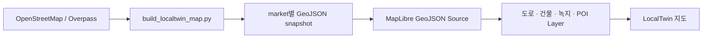
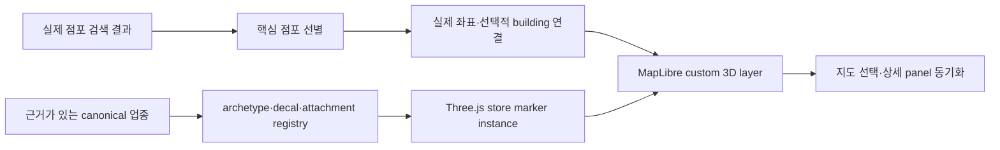

# 기능 스펙: 상권 지도, 2.5D 건물과 핵심 3D Store Marker

## 1. 문서 상태

```text
구분: 주기능의 지도 표현 계층
우선순위: P0
상태: MAP-005 basemap·지원 지역 Overlay 분리 완료, MAP-004 첫 5개 canonical 업종 marker와 LOD 연결
```

이 기능은 공공데이터 기반 상권 분석 결과를 지도 위에서 탐색하는 핵심 화면이다. 지도는 상권 전체를 비교하는 분석 공간이고, 직접 촬영한 Gaussian Splatting 현장 상세보기와 역할을 분리한다.

## 2. 목표

```text
사용자가 상권의 건물, 점포, 분석 반경과 유동인구 분포를
한 화면에서 비교하고 필요한 Layer를 직접 켜고 끌 수 있게 한다.
```

디자인 방향은 사실적인 위성지도보다 단순한 low-poly 도시 모형에 가깝다. 분석 panel은 업무 도구의 신뢰성과 가독성을 유지한다.

## 3. 화면 역할 분리

### 상권 지도

```text
시점: 상권 전체를 내려다보는 2.5D 시점
목적: 점포, 경쟁, 인구와 매출 분포 비교
현재 범위: 분석 중심 반경 100m / 300m / 500m
후속 ANALYSIS-002: 100m / 300m / 500m, 기본 300m
```

### 현장 상세보기

```text
시점: 사람이 해당 위치에 서 있는 눈높이
목적: 직접 촬영한 거리의 현장감과 시간대별 체감 혼잡도 확인
범위: 한 가게 앞 또는 거리 10~20m
```

지도 위 유동인구 Layer와 현장 상세보기의 사람 오브젝트는 같은 집계 데이터를 사용할 수 있지만 서로 다른 화면 표현이다.

## 4. 사용자 흐름

```text
1. 사용자가 상권과 업종을 선택한다.
2. 분석 반경 100m / 300m / 500m 중 하나를 선택한다.
3. 지도에서 점포, 건물과 분석 결과를 확인한다.
4. 유동인구 Layer를 켜고 시간대를 선택한다.
5. 지도 위 분포와 우측 분석 panel의 실제 집계값을 함께 확인한다.
6. 특정 가게 또는 촬영 지점을 선택한다.
7. 현장 상세보기를 열어 사람 눈높이의 3DGS 장면을 확인한다.
```

## 5. 지도 Layer

| Layer       | 기본 상태 | 표현                              | 역할                    |
| ----------- | --------- | --------------------------------- | ----------------------- |
| 기본 지도   | 켜짐      | 도로, 보도, 경계                  | 공간 맥락               |
| 2.5D 건물   | 켜짐      | low-poly extrusion                | 건물 단위 탐색          |
| 점포        | 켜짐      | 업종별 marker                     | 점포 위치와 선택        |
| 분석 반경   | 켜짐      | 반투명 원과 경계선                | 100m / 300m / 500m 범위 |
| 유동인구    | 꺼짐      | 점, 단순 사람 symbol 또는 heatmap | 시간대별 상대 밀도      |
| 주거인구    | 꺼짐      | choropleth 또는 density           | 거주 수요               |
| 매출        | 꺼짐      | 색상 구간 또는 집계 marker        | 지역별 매출 수준        |
| 개폐업 변화 | 꺼짐      | 증감 색상 또는 symbol             | 상권 변화               |

분석용 thematic Layer는 여러 개를 동시에 겹치면 의미가 흐려질 수 있다. v0.1에서는 `유동인구 / 주거인구 / 매출 / 개폐업 변화` 중 하나를 선택하는 방식을 우선 검토한다.

## 6. 지도 렌더링 구조

### v0.1 채택 구조

```text
React
→ react-map-gl
→ MapLibre GL JS
→ LocalTwin GeoJSON snapshot
```

MapLibre를 검토하는 이유:

```text
GeoJSON/vector tile 표시
건물 fill-extrusion
지도 pitch와 bearing
marker, circle, heatmap, cluster
feature-state 기반 선택 강조
custom style
```

`deck.gl`은 v0.1 기본 의존성에 포함하지 않는다. 현재 상권별 약 5,000~7,000개 도로·건물·POI feature는 MapLibre GeoJSON Layer로 렌더링한다.

`LocalTwin 지도`는 지도 엔진을 새로 만드는 기능이 아니다. MapLibre는 좌표·카메라·GPU 렌더링에 사용하고, 지원 지역의 전용 도로·건물·녹지·물·POI는 `product/scripts/build_localtwin_map.py`가 OSM/Overpass 원본에서 생성한 프로젝트 소유 GeoJSON snapshot이다. MAP-005 이후 OpenFreeMap basemap은 모든 위치에서 유지하고, LocalTwin snapshot은 지원 지역에만 올라가는 Overlay로 사용한다. 사용자는 같은 화면에서 외부 기본 지도만 보거나 전용 Overlay를 함께 보는 mode를 전환한다.



현재 검증된 Overlay snapshot:

| 상권 | 반경 | feature 수 | 파일 |
| --- | ---: | ---: | --- |
| 연남 | 720m | 5,331 | `product/apps/web/public/map/yeonnam.geojson` |
| 홍대 | 720m | 7,033 | `product/apps/web/public/map/hongdae.geojson` |
| 합정 | 720m | 6,026 | `product/apps/web/public/map/hapjeong.geojson` |

모든 파일은 `retrieved_at`, source URL, ODbL 1.0과 `© OpenStreetMap contributors` attribution을 metadata로 가진다.

관평동은 Scene 촬영 후보지만 지도용 좌표·경계·GeoJSON이 아직 검증되지 않았다. 따라서 지원 지역 registry에는 `planned`로만 기록하고 임의 위치에 Overlay를 표시하지 않는다. 좌표·경계·asset이 승인된 뒤 별도 data task에서 `ready`로 전환한다.

다음 조건이 실제 검증에서 확인될 때만 deck.gl을 재검토한다.

```text
수만 개 이상 객체의 동시 렌더링
연속적인 대규모 particle animation
GPU 집계 Layer가 필요한 분석
MapLibre 단독 구현의 측정된 성능 부족
```

## 7. 건물 Footprint와 Extrusion

건물의 바닥 외곽선인 Polygon을 높이만큼 위로 올려 단순한 low-poly 건물을 만든다.

```text
건물 footprint Polygon
+ height
→ fill-extrusion
→ 2.5D 건물
```

Canonical GeoJSON 예시:

```json
{
  "type": "Feature",
  "id": "building-101",
  "properties": {
    "height": 15,
    "height_source": "floor_estimate",
    "floors": 5
  },
  "geometry": {
    "type": "Polygon",
    "coordinates": []
  }
}
```

높이 결정 순서:

```text
1. 공식 또는 원천 데이터의 실제 높이
2. 층수 × 프로젝트에서 정한 층고
3. 정보가 없을 때 사용하는 기본 높이
```

`height_source`에는 `official / floor_estimate / default`를 저장한다. 추정 높이를 실제 측정값처럼 표시하지 않는다.

일반 건물은 평평한 지붕의 단순 extrusion으로 통일한다. 모든 건물에 창문, 간판과 복잡한 지붕을 자동 생성하는 것은 v0.1 범위에서 제외한다.

## 8. 점포와 건물 연결

```text
점포 좌표 Point
→ point-in-polygon
→ 포함되는 건물 footprint 탐색
→ store.building_id 연결
```

건물에 여러 점포가 있으면 건물 선택 후 점포 목록을 표시한다. 점포가 건물 Polygon에 포함되지 않으면 별도 marker로 유지하고 자동으로 가까운 건물에 강제 연결하지 않는다.

반경 검색은 분석 중심점과 점포 좌표 사이의 Haversine 거리를 사용한다.

### 8.1 현재 prefab과 MAP-004 목표

현재 일반 점포는 가벼운 `MapLibre HTML Marker`로 유지하고, 검색·선택된 지원 업종의 핵심 점포만 MapLibre custom layer의 Three.js mesh로 표시한다. 선택하지 않은 점포까지 큰 prefab으로 만들지 않는다.

`MAP-004`에서는 핵심 점포만 지도 공간 안의 stylized low-poly 3D store marker로 전환한다. 이 marker는 실제 건물 facade를 재현하는 storefront가 아니라, 어느 지도 회전에서도 업종과 선택 상태를 알아볼 수 있는 방향 독립형 category landmark다.

```text
기본 3D prefab geometry
+ 업종군 material/palette
+ UV-mapped category decal
+ 옥상·모서리·둘레에서 읽히는 대표 3D attachment
+ 선택·후보 상태를 나타내는 halo·label
```

배경 건물은 수천 개를 동시에 렌더링하므로 기존 `fill-extrusion`을 유지한다. 모든 건물에 창문과 장식을 생성하지 않는다.



### 8.2 표현 범위와 핵심 점포 선정

상세 3D를 적용하는 점포는 다음 우선순위로 결정한다.

```text
1. 현재 선택한 점포 1개
2. 검색 결과 상위 후보 최대 3개
3. 같은 업종의 가까운 비교 점포
4. 나머지 점포는 기존 marker 또는 POI label
```

동시에 표시하는 상세 store marker 상한은 desktop 12개, mobile 6개로 둔다. 선택 점포는 항상 포함하고 상한을 넘으면 거리, 검색 순위, 선택 업종 일치 순으로 정렬한다. 이 숫자는 첫 구현의 렌더링 상한이며 실제 성능 측정 후 변경할 수 있다.

점포별 표시 단계:

| 조건 | 표현 |
| --- | --- |
| 배경 일반 건물 | 기존 footprint `fill-extrusion` |
| 검색되지 않은 일반 점포 | POI label 또는 단순 marker |
| 검색 결과 후보 | 간단한 category marker |
| 핵심 점포 | 방향 독립형 3D store marker |
| 선택 핵심 점포 | outline·높이 offset·상세 panel 동기화 |

### 8.3 시각 언어

채택 방향은 `pastel low-poly miniature + pixel-style category decal`이다.

- 건물 geometry는 둥글고 부드러운 low-poly miniature 비율을 사용한다.
- 건물 전체를 pixel art로 만들지 않는다.
- 옥상 장식·건물 둘레 업종 band·업종 표식은 16×16 또는 32×32 pixel-art 문법으로 직접 제작한다.
- 실제 출입구와 앞면을 추정하지 않으며, 지도 회전 방향과 무관하게 최소 하나의 업종 표식이 보여야 한다.
- 실사 사진과 실제 점포 상표를 texture로 복제하지 않는다.
- 현재 LocalTwin의 beige·green·soft blue·orange palette를 유지한다.
- 실제 외관 재현이 아니라 업종과 선택 상태를 읽기 위한 시각화임을 상세 panel에 표시한다.
- 외부 참고 이미지는 형태 조사에만 사용하고 asset은 프로젝트용으로 새로 그린다. 출처와 license를 조사 기록에 남긴다.

초기 vertical slice는 공식 업종 근거가 확인된 꽃집 하나로 한다.

```text
direction-neutral small-shop prefab
+ pale green wall material
+ 4면 또는 둘레 flower pixel band
+ rooftop flower emblem
+ planter·flower basket attachment
```

형태 조사 시작점:

- [Low Poly Stylized Market Diorama](https://sketchfab.com/3d-models/low-poly-stylized-market-diorama-e886b09419e04e95a620061b5b939bd7): 작은 geometry와 색상으로 시장 분위기를 구분하는 방식
- [Pixel Art Building Illustration](https://www.fiverr.com/piyanapriyanto/draw-pixel-art-building-illustration): 업종을 간판·차양·진열 소품으로 읽게 하는 방식

위 페이지의 asset을 복사하거나 license가 확인되지 않은 model·texture를 제품에 포함하지 않는다. 구현 전 별도 reference sheet에 `URL, 확인 날짜, 참고 요소, 사용하지 않을 요소, license`를 기록하고 최종 icon과 model은 직접 제작한다.

### 8.4 업종 확장 전략

원본 업종마다 별도 GLB를 만들지 않는다. 업종 코드를 8~10개 시각 archetype으로 묶고 세부 업종은 decal과 attachment로 구분한다.

초기 registry:

| Archetype | 대표 업종 | 공통 geometry | 대표 attachment |
| --- | --- | --- | --- |
| `food_drink` | 카페·음식점·제과점 | 중립 소형 건물·업종 color band | 컵·빵·메뉴판 |
| `daily_retail` | 편의점·슈퍼·반찬가게 | 중립 소형 건물·업종 color band | 상자·장바구니 |
| `fashion_beauty` | 의류·미용실·화장품 | 중립 세로형 건물·업종 color band | 옷걸이·거울 |
| `health` | 의원·약국·동물병원 | 중립 소형 건물·업종 color band | 십자·동물 발자국 |
| `education` | 학원·독서실 | 중립 다층 건물·업종 color band | 책·연필 |
| `culture_leisure` | 서점·사진관·노래방 | 중립 소형 건물·업종 color band | 책·카메라·음표 |
| `travel_lodging` | 여행사·여관 | 중립 다층 건물·업종 color band | 가방·침대 표식 |
| `mobility_repair` | 자동차·자전거 수리 | 중립 저층 건물·업종 color band | 공구·바퀴 |
| `professional_service` | 중개업·법무·디자인 | 중립 office 건물·업종 color band | 문서·펜 |
| `generic` | 미분류·신규 업종 | 중립 기본 건물 | 물음표·category code badge |

`카페`, `음식점`, `베이커리`, `편의점`, `꽃집`을 첫 asset set으로 만들고 모든 미지원 업종은 `generic`으로 안전하게 표시한다. 2026-07-16 현재 `I21201`, `I2*` 음식점군, `I21001`, `G20405`, `G21901`을 직접 만든 방향 독립형 procedural attachment에 연결했다. 공통 body는 `storefront-body-v1.glb`, 사방 category decal은 `storefront-category-atlas.svg`를 사용한다. 업종 매핑이나 GLB·atlas load가 실패하면 procedural marker를 유지하고 WebGL 초기화가 실패하면 HTML marker로 fallback한다.

업종 분류와 시각 매핑은 다음 근거 순서를 강제한다.

1. LocalTwin canonical DB의 공식 업종 코드와 명칭을 우선한다.
2. canonical 값이 없을 때만 출처가 명시된 원천 tag를 사용한다. 예: OSM `shop=florist`, `amenity=cafe`.
3. 점포명에 `flower`, `약국`, `카페` 같은 단어가 포함됐다는 이유만으로 업종을 추정하지 않는다.
4. canonical 값과 원천 tag가 충돌하거나 근거가 불충분하면 전용 장식을 사용하지 않고 `generic`으로 표시한다.
5. 화면과 Run Report에 `categorySource`, 원천 ID와 최종 visual mapping을 추적할 수 있어야 한다.

예를 들어 이름에 `Flower`가 포함되어도 원천 분류가 `cafe`이면 꽃집 장식을 적용하지 않고 카페로 표시한다.

#### 첫 canonical 꽃집 vertical slice

2026-07-16에 이름만 보고 `cafe`를 꽃집으로 바꾸던 기존 prototype을 제거하고, canonical 업종이 실제로 꽃집인 점포를 연결했다.

```text
점포: 플로리스트오재윤
store ID: MA010120220805312100
category: G21901 / 꽃집
market: 3110562 / 연남
좌표: 126.923054545317, 37.5653774848447
```

검색 API의 `category_code=G21901`이 registry의 꽃집 attachment를 선택한다. 선택 결과는 같은 좌표의 HTML prefab을 제거한 뒤 custom 3D layer 한 개로 표시하고, 선택 변경·unmount 시 이전 layer와 geometry/material을 정리한다. `CS300028`은 공식 상권 지표의 화초 alias로만 남긴다.

### 8.5 Asset 계약

ARCH-002 이후 확정된 제품 web root를 기준으로 다음 구조를 사용한다.

```text
public/assets/store-markers/
  manifest.json
  models/
    small-shop.glb
    corner-shop.glb
    service-shop.glb
  textures/
    category-atlas.png
    palette-atlas.png
  attachments/
    planter.glb
    flower-basket.glb
    menu-board.glb
```

`manifest.json` 최소 계약:

```json
{
  "version": "1.0.0",
  "archetypes": {
    "food_drink": {
      "model": "models/small-shop.glb",
      "materialVariant": "warm_orange",
      "decal": "cafe",
      "attachments": ["menu-board", "planter"]
    }
  },
  "categories": {
    "VERIFIED_CAFE_CODE": { "archetype": "food_drink", "decal": "cafe" },
    "VERIFIED_FLORIST_CODE": { "archetype": "daily_retail", "decal": "flower", "attachments": ["flower-basket"] }
  },
  "fallback": { "archetype": "generic", "decal": "unknown" }
}
```

Asset 규칙:

- 모델은 web 전달용 binary glTF인 `.glb`를 사용한다.
- 동일 prefab geometry와 material을 instance 간 재사용한다.
- pixel decal은 texture atlas 한 장에 모으고 UV 영역만 바꾼다.
- pixel 표식은 확대 시 흐려지지 않게 nearest magnification을 사용하되 축소 시 shimmer 여부를 실제 mobile에서 확인한다.
- real-time shadow map은 사용하지 않고 baked shading 또는 단순 shadow plane을 사용한다.
- texture와 geometry는 component unmount 또는 map 교체 시 `dispose()`한다.
- 초기 asset 전체 전송량은 압축 전후를 Run Report에 기록하고 기존 build와 비교한다. 숫자만 통과 기준으로 삼지 않고 첫 지도 표시 지연 여부를 함께 확인한다.

### 8.6 점포·건물 데이터 계약

3D store marker는 화면용 hard-coded 점포 배열이 아니라 SEARCH-001 결과를 입력으로 받는다.

필수 입력:

```ts
type StoreMarkerPlacement = {
  storeId: string;
  name: string;
  categoryCode: string;
  categoryName: string;
  categorySource: "canonical" | "source-tag" | "unknown";
  categorySourceId: string | null;
  categoryMappingStatus: "verified" | "generic";
  longitude: number;
  latitude: number;
  buildingId: string | null;
  storeCountInBuilding: number;
  visualPriority: "selected" | "candidate" | "context";
};
```

배치 규칙:

1. 점포 Point가 building Polygon 안에 있으면 `buildingId`를 연결한다.
2. 같은 건물에 여러 점포가 있으면 대표 marker 하나와 점포 수를 표시하고, 선택 시 실제 점포 목록을 제공한다.
3. Point가 어떤 Polygon에도 포함되지 않으면 가까운 건물에 강제 연결하지 않고 marker fallback을 사용한다.
4. prefab은 90도 단위 회전과 임의 map bearing에서도 업종 표식이 읽히는 방향 독립형 구조로 만든다.
5. 도로 방향·출입구·facade를 추정하거나 실제 앞면인 것처럼 표현하지 않는다.
6. `categoryMappingStatus`가 `generic`이면 업종 전용 decal·attachment를 적용하지 않는다.
7. 좌표계는 WGS84로 통일한 후 지도에 전달한다.

### 8.7 Rendering 구조

현재 stack의 MapLibre와 Three.js를 사용하고 새 3D framework는 추가하지 않는다.

기술 기준은 [MapLibre GL JS](https://maplibre.org/projects/gl-js/)의 custom 3D layer 가능 범위와 [Three.js GLTFLoader](https://threejs.org/docs/pages/GLTFLoader.html)의 glTF 2.0 asset loading·resource cleanup 주의를 따른다.

예상 module:

```text
features/map/store-markers/
  StoreMarkerLayer.ts
  StoreMarkerAssetRegistry.ts
  StoreMarkerPlacement.ts
  storeMarkerSelection.ts
  storeMarkers.test.ts
```

책임:

- `StoreMarkerLayer`: MapLibre custom layer lifecycle (`onAdd`, `render`, `onRemove`)
- `StoreMarkerAssetRegistry`: GLB·texture를 한 번 load하고 검증된 archetype variant 제공
- `StoreMarkerPlacement`: WGS84 좌표를 Mercator model matrix로 변환
- `storeMarkerSelection`: desktop/mobile 상한과 핵심 점포 결정
- React adapter: 선택 state와 map layer update를 연결

구현 원칙:

- MapLibre가 camera와 WebGL context를 소유한다.
- 별도 무한 animation loop를 만들지 않고 map repaint lifecycle을 사용한다.
- 모델 좌표는 `MercatorCoordinate.fromLngLat`와 meter scale로 계산한다.
- 선택·hover 변화는 geometry reload 없이 instance transform/material state만 바꾼다.
- GLB load 실패, WebGL context 문제 또는 reduced device capability에서는 기존 HTML marker로 즉시 fallback한다.
- 초기 구현에는 deck.gl 또는 별도 renderer canvas를 추가하지 않는다.

### 8.8 Interaction과 접근성

custom 3D mesh는 DOM button이 아니므로 접근 가능한 조작 경로를 별도로 유지한다.

- 지도 밖 점포 목록의 실제 button을 keyboard source of truth로 유지한다.
- 목록 focus와 3D 선택 state를 양방향 동기화한다.
- canvas pointer 선택은 raycast 또는 screen-space hit target으로 store ID를 찾는다.
- 선택 state를 색상만으로 구분하지 않고 scale·outline·label을 함께 사용한다.
- `prefers-reduced-motion`에서는 bounce·회전 animation 없이 즉시 상태를 전환한다.
- WebGL fallback에서도 검색·선택·상세보기 기능은 유지한다.

### 8.9 성능과 LOD

LOD 기준:

```text
먼 zoom: 핵심 점포도 category symbol
중간 zoom: 단순 marker body + 둘레 category band
가까운 zoom: 옥상·모서리 attachment 포함 상세 marker
mobile: desktop보다 낮은 상세 상한과 attachment 수
```

검증은 동일한 browser·viewport·상권·점포 수에서 변경 전후를 비교한다.

- GLB와 texture를 점포마다 다시 load하지 않는다.
- 동일 archetype은 가능하면 `InstancedMesh` 또는 공유 geometry/material을 사용한다.
- 선택 변경 시 network request와 asset parse가 다시 발생하지 않아야 한다.
- desktop 12개·mobile 6개 상세 store marker에서 지도 pan·zoom·rotate가 입력을 놓치지 않는지 확인한다.
- median frame time, first map render와 asset load 시간을 기록하되 기준 측정 없이 `60fps 보장`이라고 표현하지 않는다.
- mobile GPU에서 context loss, 과도한 device pixel ratio와 memory leak을 확인한다.

### 8.10 구현 순서

```text
Gate 0: ARCH-002 후 최종 product asset 경로 확인
Gate 1: SEARCH-001의 실제 점포 ID·업종·좌표 contract 확인
Gate 2: 업종 근거가 확인된 꽃집 1개 vertical slice와 generic fallback 제작
Gate 3: MapLibre custom 3D layer에서 실제 위치·방향 독립 가독성·선택 검증
Gate 4: 카페·음식점·베이커리·편의점 asset set 확대
Gate 5: canonical 업종 → archetype registry 확대
Gate 6: desktop/mobile 성능·접근성·fallback 회귀 검증
```

Gate 2가 실패하면 전체 asset 제작으로 확대하지 않는다. 먼저 좌표·camera·context 공유 문제를 해결한다.

### 8.11 예상 변경 파일

ARCH-002 결과에 따라 root는 달라질 수 있지만 역할 기준 예상 범위는 다음과 같다.

```text
web/src/features/map/store-markers/*     custom layer·asset·placement
web/src/features/market/types.ts          점포 ID·업종 코드·building 연결 type
web/src/App.tsx 또는 지도 feature shell   layer 조합만 연결
web/public/assets/store-markers/*          GLB·texture atlas·manifest
api search response schema                실제 점포 배치 필드
tests                                     registry·selection·fallback·UI 회귀
docs/design/design-system.md              시각 언어
docs/features/market-map-experience.md     canonical 기능 스펙
```

### 8.12 검증 시나리오

자동 검증:

```text
manifest의 모든 model·decal·attachment 경로가 존재한다.
모든 canonical category는 명시 mapping 또는 generic fallback을 가진다.
전용 업종 장식은 category source와 visual mapping이 일치하는 검증된 점포에만 적용된다.
핵심 점포 상한과 정렬이 desktop/mobile에서 결정적이다.
동일 storeId 선택이 목록·지도·inspector에서 일치한다.
asset load 실패와 WebGL fallback에서 HTML marker가 표시된다.
component unmount 후 geometry·material·texture dispose가 호출된다.
기존 market/category/radius UI test가 유지된다.
```

수동 검증:

```text
연남·홍대·합정에서 점포가 실제 좌표에 붙어 있다.
map rotate 시 어느 방향에서도 업종 표식과 선택 상태를 알아볼 수 있다.
꽃집·카페·음식점·베이커리·편의점이 간판과 장식으로 구분된다.
점포명만으로 업종을 추정하지 않고 category source와 visual mapping을 확인할 수 있다.
선택 점포가 색상 외 outline·scale·label로 구분된다.
390×844에서 pan·zoom·점포 선택과 inspector 이동이 가능하다.
reduced motion과 WebGL fallback에서도 핵심 검색 흐름이 가능하다.
```

### 8.13 완료 조건과 제외 범위

완료 조건:

- 실제 검색 결과의 핵심 점포가 지도 좌표의 방향 독립형 3D store marker로 표시된다.
- 꽃집과 현재 지원 4개 업종이 직접 제작한 decal·대표 장식으로 구분된다.
- 업종 전용 장식은 canonical 업종 또는 명시적 원천 tag로 검증된 경우에만 적용된다.
- 신규 업종은 새 GLB 없이 registry mapping과 decal 추가로 확장할 수 있다.
- 미분류·상충 업종, 건물 연결 실패, asset load 실패가 generic 또는 HTML marker fallback으로 처리된다.
- 기존 지도·필터·상세 panel 동작과 mobile 접근성이 회귀하지 않는다.

제외:

- 서울 모든 건물의 facade 자동 생성
- 실제 점포 외관·상표의 복제
- 실내 모델과 사람 눈높이 탐색
- photorealistic texture와 real-time shadow
- 점포 수백 개의 동시 상세 3D 표시

## 9. 유동인구 Layer

### 입력

```text
지역 또는 상권
기준 날짜와 시간대
population_total 또는 혼잡도 지수
공간 집계 단위
데이터 출처와 산정 방식
```

### 시간 선택

v0.1 대표 시간대:

```text
10시 / 13시 / 15시 / 18시
```

시간대 전환 시 source data 또는 filter를 변경하고, opacity와 크기 transition으로 변화가 부드럽게 보이게 한다.

### 표현 원칙

- 지도 위 점이나 사람 symbol은 집계값을 이해시키는 시각적 표본이다.
- symbol 하나가 실제 사람 한 명을 의미하지 않으면 legend에 그 사실을 명시한다.
- 실제 개인 위치 또는 이동 경로처럼 표현하지 않는다.
- 실제 값, 단위, 집계 기간과 출처는 분석 panel에 별도로 표시한다.
- 이동 방향 데이터가 없으면 도로를 따라 움직이는 사람 흐름을 만들지 않는다.

표기 예시:

```text
예상 유동인구: 약 3,200명/시간
지도 위 표시는 집계값의 상대적 밀도를 시각화한 것입니다.
```

절대 인구 단위가 없는 경우:

```text
혼잡도 지수: 72/100
지도 위 표시는 실제 사람 수 또는 위치를 의미하지 않습니다.
```

## 10. 선택과 상세 Panel

건물 또는 점포를 선택하면 다음 내용을 표시한다.

```text
점포명과 업종
주소와 거리
동일 업종 경쟁 점포 수
입지 점수와 산출 근거
시간대별 유동 특성
매출·개폐업·영업 안정성 지표
데이터 출처
현장 상세보기 action
```

좌석 수처럼 공공데이터에 없는 정보는 직접 관찰 또는 점포 제공값이 있을 때만 표시한다.

## 11. PoC 검증 Gate

MapLibre 채택 전 대상 상권 후보에서 다음을 확인한다.

```text
건물 footprint 확보 가능 여부
건물 높이 또는 층수 데이터의 충분성
점포 좌표와 건물 Polygon 연결 성공률
500m 범위 extrusion 렌더링 성능
유동인구 Layer의 공간 해상도
desktop/mobile의 조작과 가독성
```

건물 데이터가 부족하면 fallback을 사용한다.

```text
일반 2D 지도
+ 확보된 일부 건물만 extrusion
+ 점포 marker와 분석 Layer
```

## 12. 완료 기준

```text
상권 한 곳의 2.5D 건물을 표시할 수 있다.
업종과 분석 반경을 변경할 수 있다.
건물 또는 점포를 선택할 수 있다.
유동인구 Layer를 켜고 끌 수 있다.
10시 / 13시 / 15시 / 18시 데이터를 전환할 수 있다.
실제 집계값과 지도 symbol의 의미를 구분해 표시한다.
선택한 위치에서 현장 상세보기로 이동할 수 있다.
```

## 13. 제외 범위

```text
지도 렌더링 엔진 자체 개발
도시 전체의 정교한 3D model 자동 생성
실시간 개인 위치 추적
근거 없는 이동 경로 animation
모든 건물의 창문·지붕·간판 자동 생성
v0.1의 필수 deck.gl 의존성
Google Earth 수준의 photorealistic 도시 지도
```

## 14. 현재 프로토타입 상태

2026-07-16 기준 React 프로토타입에서 다음을 조작할 수 있다.

```text
LocalTwin GeoJSON 지도의 이동과 확대/축소
항상 유지되는 OpenFreeMap basemap 위 LocalTwin Overlay / 기본 지도 mode 전환
건물 Layer와 후보 점포 prefab의 독립적인 표시 전환
서로 가까운 연남·홍대·합정 상권 전환
카페·음식점·베이커리·편의점 업종 선택
100m / 300m / 500m 반경 선택
경쟁 밀도 / 시간대 수요 Layer 전환
OSM POI label과 후보 점포 prefab 표시 전환
상권 비교, 점수 근거와 데이터 기준 dialog
Docs Home 복귀
```

현재 도로·건물·POI는 2026-07-11에 생성한 OpenStreetMap snapshot을 2026-07-16에 각 중심 720m로 clip한 결과다. OpenFreeMap basemap은 지원 영역 밖에서도 계속 보이고, 연남·홍대·합정 Overlay만 전용 pastel 2.5D 표현을 추가한다. 상권·업종 분석은 canonical SQLite 기반 FastAPI를 우선 사용하고 API가 없으면 같은 DB에서 생성한 검증 snapshot으로 fallback한다. 선택 상권은 canonical polygon을 따라 노란 core·glow·halo 경계로 표시한다. 지원 지역에서는 기본 건물과 LocalTwin 건물을 동시에 렌더링하지 않는다. 선택한 지원 업종은 공유 GLB body·category atlas·procedural attachment를 조합한 custom 3D marker 한 개로 표시한다. 주변 HTML marker는 선택 marker 105m 안에서 제거하고 desktop 최대 12개·mobile 최대 6개로 제한한다. 선택 시 지도는 16.8 zoom으로 이동하고 300m 중심 표식은 투명 ring과 바깥 label로 바뀌어 3D를 가리지 않는다. MAP-004의 asset cache까지 연결됐지만 복수 점포 건물 묶음과 회전·reduced-motion 성능 검증이 남아 있으므로 전체 Task는 계속 진행 중이다.

### 14.1 후속 이동형 반경 분석

현재 스프린트 마감 후 `ANALYSIS-002 / WEB-002 / WEB-003`에서 다음 동작을 구현한다.

```text
일반 지도 탐색: 지도를 움직여도 확정된 분석 중심 유지
분석 위치 이동: 반경 원과 중심을 표시한 채 후보 좌표 선택
확정: `이 위치에서 검색`을 눌렀을 때만 API 요청
취소: 이전 중심·반경·결과 복원
반경: 100m / 300m / 500m, 기본 300m
```

지원 중심은 연남·홍대·합정 polygon 내부로 제한하되, 원은 경계를 넘을 수 있다. 점포는
상권 경계로 자르지 않고 실제 중심 거리로 포함 여부를 판정한다. 반경 점포 집계와 서울시
상권 단위 매출·유동인구 집계는 UI label과 API metadata에서 명확히 구분한다.

### 14.2 MAP-005 구현 경계

현재 코드는 `LocalTwin` mode에서 외부 basemap을 빈 style로 교체하고 선택 상권 GeoJSON 하나만 표시한다. MAP-005는 이를 다음 계층으로 바꾼다.

```text
OpenFreeMap basemap: 항상 유지
기본 건물 extrusion: 독립 toggle
연남·홍대·합정 LocalTwin Overlay: LocalTwin mode에서만 표시
관평동: 좌표·경계·asset 승인 전 planned
분석 원·점포 marker: basemap/Overlay mode와 독립
```

코드 원본은 `.harness/tasks/MAP-005-base-map-supported-overlays.md`의 region registry, Layer ID, 파일 책임과 검증 계획을 따른다. 반경 분석은 그 위에 `.harness/tasks/ANALYSIS-002-radius-search.md`를 구현하고, 마지막으로 `.harness/tasks/EVAL-002-front-api-smoke.md`에서 실제 development Supabase 경로와 오류 상태를 검증한다.

## 15. 관련 문서

- [공공데이터 기반 상권 분석](./market-analysis.md)
- [혼잡도 3D 기반 탐색](./3d-congestion-explorer.md)
- [LocalTwin 디자인 시스템](../design/design-system.md)
- [데이터 소스 매핑](../data/data-source-mapping.md)
