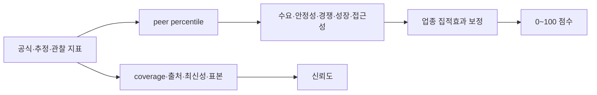

# 기능 스펙: LocalTwin 상권 점수 공식

## 1. 문서 상태

```text
공식 버전: 1.1.0
상태: SCORE-002 안전성 보완 구현·검증 완료
목적: 후보 상권 비교와 근거 설명
비목적: 창업 성공 확률 예측
후속 계획: SCORE-003 업종별 calibration
```

## 2. 판단 원칙

상권 점수는 절대적인 `좋음/나쁨` 판정이 아니다. 같은 기간, 업종, 공간 유형과 반경을 가진 peer group 안에서 상대적인 기회와 위험을 설명한다.



점수와 신뢰도는 반드시 따로 표시한다. 점수가 높아도 근거 coverage가 낮으면 `근거 부족` 상태다.

## 3. Peer Group

백분위는 다음 조건이 같은 비교군에서 계산한다.

```text
기간: 같은 분기
업종: 같은 canonical category
공간 유형: 골목상권 / 발달상권 / 관광특구 등
반경: 100m / 300m / 500m
지역: 데이터가 충분한 최소 행정 범위
```

비교군이 너무 작으면 상위 지역 단위로 넓히고 화면에 실제 peer group을 표시한다. 최소 표본 기준은 metric별로 기록하며 30개 미만이면 신뢰도를 낮춘다.

## 4. 입력 지표

| Component | 기본 가중치 | Metric | 방향 |
| --- | ---: | --- | --- |
| 수요 | 30% | 점포당 추정매출 45%, 유동 수요 35%, 수요 증가율 20% | 높을수록 긍정 |
| 영업 안정성 | 25% | 동일 cohort 생존율 55%, 폐업률 45% | 생존율은 높게, 폐업률은 낮게 |
| 경쟁 적합성 | 20% | 동일 업종 밀도 65%, 업종 다양성 35% | 밀도는 기본적으로 압력, 집적효과 별도 보정 |
| 성장성 | 15% | 매출 증가율 55%, 점포 순증률 45% | 높을수록 긍정 |
| 접근성 | 10% | 대중교통 55%, 보행 접근성 45% | 높을수록 긍정 |

매출은 서울시 상권분석서비스의 `추정매출`이며 실제 세무 매출로 표현하지 않는다. 점포, 개·폐업과 프랜차이즈 정보는 점포 데이터에서 사용한다.

## 5. 정규화와 Component 계산

Metric `m`의 peer percentile을 `p_m`이라고 한다.

```text
높을수록 긍정인 metric: q_m = p_m
낮을수록 긍정인 metric: q_m = 1 - p_m
```

Component `c`는 사용 가능한 metric만 다시 정규화한다.

```text
C_c = 100 × Σ(q_m × w_m) / Σ(w_m)
```

전체 기본점수:

```text
B = Σ(C_c × W_c) / Σ(W_c)
```

누락 지표를 0점으로 처리하지 않는다. 해당 가중치를 제외하고 `data_coverage`와 신뢰도를 낮춘다.

## 6. 특수상권과 업종 집적효과

빵집처럼 같은 업종이 모여 방문 목적지를 형성하는 경우, 동일 업종 수를 무조건 경쟁 감점으로 처리하면 안 된다.

업종 특화 정도는 Location Quotient로 계산한다.

```text
LQ = (지역의 선택 업종 점포 / 지역 전체 점포)
     / (peer의 선택 업종 점포 / peer 전체 점포)
```

최소 5개 점포와 `LQ ≥ 1.25`일 때 특화상권 검사를 시작한다.

### 생산적 집적상권

```text
점포당 매출 percentile ≥ 50
유동 수요 percentile ≥ 55
폐업률 percentile ≤ 60
매출·수요·생존·성장 근거 평균 ≥ 58
```

조건을 만족하면 집적효과 보정 `A`를 최대 `+8점` 적용한다.

### 과포화 상권

```text
LQ가 높음
+ 점포당 매출 percentile < 45
또는 폐업률 percentile > 65
+ 부정 근거 평균 ≥ 58
```

조건을 만족하면 최대 `-8점`을 적용한다. 어느 쪽도 충분히 입증되지 않으면 `특화상권 관찰`로 표시하고 점수를 보정하지 않는다.

최종 점수:

```text
S = clamp(B + A, 0, 100)
```

## 7. 점수 구간

| 점수 | 표시 | 해석 |
| ---: | --- | --- |
| 80~100 | 강한 후보 | 다수 component가 peer보다 강함 |
| 65~79.9 | 유망 후보 | 장점이 위험보다 우세 |
| 50~64.9 | 혼합 신호 | 장점과 위험을 함께 검토 |
| 35~49.9 | 주의 필요 | 약한 component가 뚜렷함 |
| 0~34.9 | 높은 위험 | 여러 위험 신호가 동시 발생 |

이 구간은 성공 확률이 아니다. 같은 조건의 후보지를 정렬하고 근거를 읽기 위한 UI band다.

## 8. 신뢰도

Metric별 근거 강도:

```text
E_m = 0.45 × source reliability
    + 0.35 × freshness
    + 0.20 × sample strength
```

전체 신뢰도:

```text
Confidence = data coverage × weighted mean(E_m) × 100
```

Source reliability 상한:

| Source type | 상한 |
| --- | ---: |
| official | 1.00 |
| official_estimate | 0.90 |
| derived | 0.85 |
| observed | 0.70 |
| fixture | 0.25 |

`60 미만`이면 `insufficient_evidence`로 표시하고 점수를 결론처럼 사용하지 않는다.

## 9. 사용자 설명 구조

화면은 숫자 한 개보다 다음 순서로 설명한다.

```text
총점과 신뢰도
→ Component별 점수와 가중치
→ 강한 근거 2개 / 주의 근거 2개
→ 특수상권 분류와 보정값
→ 출처·기간·단위
→ 누락 지표와 한계
```

API는 `/api/v1/scores/evaluate`에서 `formula_version`, component, cluster, reasons와 limitations를 함께 반환한다.

## 10. 조사 근거

- [서울시 상권분석서비스 점포-상권](https://data.seoul.go.kr/dataList/datasetView.do?currentPageNo=1&infId=OA-15577&serviceKind=1&srvType=A): 점포, 개·폐업, 프랜차이즈 근거
- [서울시 상권분석서비스 추정매출-상권](https://data.seoul.go.kr/dataList/OA-15572/F/1/datasetView.do): 업종별 추정매출 근거
- [Quantifying Retail Agglomeration using Diverse Spatial Data](https://arxiv.org/abs/1612.06441): retail location choice에서 집적효과를 별도로 고려해야 한다는 연구 근거

집적효과 연구의 325m 결과를 LocalTwin의 모든 업종에 인과적으로 적용하지 않는다. 제품의 100m/300m/500m 반경별로 재검증하고, 매출·수요·생존 근거가 동반될 때만 제한된 보정을 적용한다.

## 11. 제한

```text
개별 점포 성공을 예측하지 않는다.
임대료, 좌석 수와 운영자 역량이 없으면 한계로 표시한다.
카드 기반 추정매출을 실제 총매출로 표현하지 않는다.
peer group과 공식 버전이 다른 점수를 직접 비교하지 않는다.
가중치는 평가 fixture와 사용자 연구 후 version을 올려 조정한다.
```

## 12. 공식 보완 계획

### 12.1 검토 결과

현재 `1.0.0` 공식의 설명 가능성, 점수와 confidence 분리, peer percentile과 제한된 집적 보정 구조는 유지한다. 다음 항목은 실제 코드와 첨부 검토를 대조해 확인한 보완 대상이다.

| ID | 현재 동작 | 위험 | 처리 Task |
| --- | --- | --- | --- |
| S1 | component 안의 존재하는 metric만 재정규화 | metric 하나가 component 전체를 대표할 수 있음 | SCORE-002 |
| S2 | fixture도 score·confidence 계산에 들어가며 confidence만으로 supported 결정 | fixture가 충분하면 supported 가능 | SCORE-002 |
| S3 | freshness 최저값이 항상 0.35 | 매우 오래된 빠른 변화 지표가 과대평가될 수 있음 | SCORE-002 |
| S4 | `sample_size=None`을 0.60으로 처리 | 표본 미상이 표본 10개보다 유리할 수 있음 | SCORE-002 |
| S5 | 집적 보정이 metric evidence strength를 사용하지 않음 | 낮은 신뢰도 근거로 최대 ±8점 가능 | SCORE-002 |
| S6 | 동일 업종 5개만 확인하고 전체 점포 최소값이 없음 | 작은 상권에서 LQ가 불안정함 | SCORE-002 |
| S7 | 모든 업종이 같은 component weight 사용 | 업종별 성공 조건 차이를 반영하지 못함 | SCORE-003 |
| S8 | percentile peer 구성과 표본이 response에 충분히 드러나지 않음 | 잘못된 비교군을 발견하기 어려움 | SCORE-003 |
| S9 | 상관이 높은 metric을 독립 근거처럼 합산할 수 있음 | 같은 현상을 중복 가중할 수 있음 | SCORE-003 |
| S10 | 점수 band와 weight가 미래 결과로 calibration되지 않음 | 절대적 성공 가능성처럼 오해될 수 있음 | SCORE-003 |

`1.0.0` 결과는 삭제하지 않는다. formula version과 입력 snapshot을 함께 보존해 `1.1.0` 결과와 직접 비교할 수 있게 한다.

### 12.2 SCORE-002 목표: 공식 1.1.0 안전성 수정

`1.1.0`은 현재 지표와 기본 component weight를 유지하면서 누락·fixture·오래된 데이터·표본 미상·집적 보정의 안전성을 수정한다.

#### A. 누락 metric의 중립 수축

현재처럼 존재하는 metric만 평균한 `observed component score`는 계산하되, coverage가 낮으면 50점 쪽으로 수축한다.

Component `c`에서:

```text
r_c = 사용 가능한 metric 내부 가중치 합 / 전체 내부 가중치 합
O_c = 사용 가능한 metric의 정규화된 weighted mean × 100
C_c = 50 + r_c × (O_c - 50)
```

metric이 하나도 없으면:

```text
r_c = 0
O_c = null
C_c = 50
```

전체 기본 점수:

```text
B = Σ(C_c × W_c)
```

모든 component weight 합은 1이므로 다시 `available_component_weight`로 나누지 않는다.

예시:

```text
수요 component에서 점포당 매출만 존재
점포당 매출 percentile quality = 80
coverage = 0.45

기존: 수요 점수 80
1.1.0: 50 + 0.45 × (80 - 50) = 63.5
```

Response의 component에는 다음을 추가한다.

```json
{
  "score": 63.5,
  "observed_score": 80.0,
  "coverage": 45.0,
  "configured_weight_percent": 30.0,
  "evidence_keys": ["sales_per_store"]
}
```

기존 `score`, `weight_percent`, `evidence_keys`는 호환을 위해 유지하고 `weight_percent` 의미를 문서화한다.

#### B. fixture hard gate

`source_type=fixture` metric은 제품 score, coverage와 confidence 계산에서 제외한다.

fixture가 하나라도 입력되면 다음 blocker를 추가한다.

```text
fixture_present
```

개발 화면에서 계산 결과를 확인할 수는 있지만 `decision_status`는 항상 `insufficient_evidence`다. fixture가 모든 metric이면 score는 중립 기준 50점이고 confidence와 coverage는 0이다.

#### C. 표본 의미 분리

`sample_size=None` 하나로 `모름`과 `전수 행정자료`를 함께 표현하지 않는다.

`ScoreMetric`에 다음 필드를 추가한다.

```python
sample_basis: Literal["known", "unknown", "administrative_population"] = "unknown"
```

계산:

```text
known: min(1, sqrt(sample_size / 30))
unknown: 0.40
administrative_population: 1.00
```

검증 규칙:

- `known`이면 `sample_size`가 필요하다.
- `unknown`이면 `sample_size`를 사용하지 않는다.
- `administrative_population`은 provider manifest가 전수 집계임을 증명할 때만 importer가 설정한다.
- 기존 client가 필드를 보내지 않으면 `unknown`으로 처리해 하위 호환한다.

#### D. metric별 freshness policy

최신성은 공통 최저값 0.35를 제거하고 metric 변화 속도별 policy를 사용한다.

초기 `1.1.0` policy:

| Policy | Metric | Grace | Expire |
| --- | --- | ---: | ---: |
| `fast` | 매출·유동·수요 증가·매출 증가·점포 순증·폐업률 | 180일 | 730일 |
| `cohort` | 생존율 | 365일 | 1,095일 |
| `structural` | 대중교통·보행 접근성·업종 다양성·밀도 | 365일 | 1,825일 |

계산:

```text
age ≤ grace: freshness = 1
grace < age < expire: freshness = 1 - (age - grace) / (expire - grace)
age ≥ expire: freshness = 0
```

policy 이름, grace, expire와 계산 freshness를 evaluation detail에 남긴다. 이 기간은 첫 안전 기준이며 SCORE-003의 과거 결과 검증에서 조정한다.

#### E. supported 판정 blocker

`decision_status=supported`는 confidence 하나만 보지 않는다.

```text
supported 조건:
confidence ≥ 60
data_coverage ≥ 60
fixture metric 없음
필수 metric 누락 blocker 없음
peer 표본 blocker 없음
```

`MarketScoreResponse`에 다음을 추가한다.

```python
decision_blockers: list[str]
```

초기 blocker code:

```text
fixture_present
coverage_below_60
confidence_below_60
required_metric_missing
peer_sample_too_small
cluster_evidence_too_weak
```

UI는 code를 그대로 노출하지 않고 한국어 설명 mapping을 사용한다.

#### F. 집적 보정 안전성

집적 판정 시작 조건:

```text
전체 점포 수 ≥ 20
동일 업종 점포 수 ≥ 5
LQ ≥ 1.25
```

조건을 만족하지 않으면 `ordinary`, adjustment 0이다.

생산적·과포화 판정에 실제로 사용한 metric의 evidence strength weighted mean을 `cluster_evidence_confidence`로 계산한다. fixture는 제외한다.

```text
cluster_evidence_confidence < 0.60
→ specialized_watch
→ adjustment = 0
→ cluster_evidence_too_weak blocker
```

충분한 경우:

```text
raw_adjustment = 기존 LQ·긍정/부정 근거 기반 최대 ±8점
effective_adjustment = raw_adjustment × cluster_evidence_confidence
```

`ClusterResult`에 다음을 추가한다.

```python
raw_adjustment: float
evidence_confidence: float
evidence_keys: list[str]
```

최종 점수는 계속 다음 범위를 지킨다.

```text
S = clamp(B + effective_adjustment, 0, 100)
```

### 12.3 SCORE-002 코드 변경 설계

예상 변경:

| 파일 | 변경 |
| --- | --- |
| `market_score.py` | sample basis, freshness policy, neutral shrinkage, blockers, cluster evidence 적용 |
| `market_analysis.py` | source metadata에서 sample basis·age·peer metadata 구성 |
| `test_market_score.py` | 공식 1.1.0 단위·회귀 test |
| `test_market_analysis.py` | canonical response의 coverage·blocker·source metadata test |
| `market-analysis.json` | 1.1.0으로 snapshot 재생성 |
| `evaluate_market_analysis.py` | 1.0.0/1.1.0 비교와 blocker 검사 |
| FE score type/UI | 새 additive field와 blocker 한국어 설명 |

함수 분리 목표:

```text
_metric_evidence_strength(metric, key)
_freshness_strength(key, age_days)
_sample_strength(metric)
_component_result(component, metrics)
_decision_blockers(...)
_cluster_result(request, evidence_by_key)
```

`evaluate_market_score()`는 위 함수를 조합하고 계산 세부를 직접 중복하지 않는다.

### 12.4 SCORE-002 필수 회귀 test

| Test | 입력 | 기대 결과 |
| --- | --- | --- |
| full official | 11개 최신 official metric | 기존 방향성 유지, coverage 100 |
| one metric | 수요의 점포당 매출만 80 percentile | 수요 63.5, coverage 13.5 전체 반영 |
| no metric | 빈 metrics | score 50, coverage 0, insufficient |
| full fixture | 11개 fixture | score 50, coverage/confidence 0, fixture blocker |
| mixed fixture | official+fixture | fixture 제외 후 계산, insufficient 유지 |
| stale fast | expire를 지난 매출 | freshness 0, confidence 감소 |
| current structural | 최신 접근성 | freshness 1 |
| sample unknown | sample basis unknown | sample strength 0.40 |
| administrative population | 전수 manifest 근거 | sample strength 1.00 |
| tiny cluster | 전체 6·동일 5 | ordinary, adjustment 0 |
| weak cluster evidence | LQ 높고 evidence confidence 0.5 | specialized_watch, adjustment 0 |
| trusted productive | 충분한 점포·근거 | effective bonus 0~8 |
| trusted saturated | 충분한 점포·부정 근거 | effective penalty -8~0 |
| response compatibility | 기존 request JSON | 200, 새 필드는 additive |

기존 productive score가 정확히 같은 숫자를 유지해야 하는 것은 아니다. 방향성, 범위, blocker와 공식 version을 검증한다.

#### SCORE-002 구현 결과

2026-07-16에 공식 `1.1.0`을 구현했다. API 단위 회귀 14개와 canonical 상권·업종 12개
평가가 통과했다.

```text
canonical coverage: 55.0%
canonical confidence: 52.0%
decision: 12개 모두 insufficient_evidence
공통 blocker: coverage_below_60, confidence_below_60
score 범위: 37.6~53.1
cluster: ordinary 7, specialized_watch 4, saturated_cluster 1
```

`1.0.0`의 12개 점수 범위는 28.3~51.5였고 `1.1.0`은 37.6~53.1이다. 누락 지표를
제외한 뒤 남은 값만 재정규화하던 방식에서 50점 중립 수축으로 바뀌어, 낮은 일부 지표만 있던
case가 최대 10.9점 상승하고 한 case는 0.2점 하락했다. 이는 성능 향상 주장이 아니라 누락
근거의 과도한 대표를 줄인 공식 변경 결과다.

현재 canonical 응답은 필수 매출·유동 지표와 충분한 peer 표본을 갖지만 전체 configured
metric coverage가 55%다. 따라서 점수는 표시하되 비교 판단을 지원한다고 표시하지 않는다.
누락 지표가 실제 데이터로 보강되기 전까지 이 blocker를 임의로 낮추지 않는다.

### 12.5 SCORE-003 목표: 업종별 profile과 과거 결과 calibration

`SCORE-003`은 데이터가 충분해진 뒤 진행한다. 임의의 업종별 weight를 코드에 바로 넣지 않는다.

선행 데이터 Gate:

```text
동일 정의의 연속 5개 이상 분기
canonical category·market type·period·공간 범위
미래 4분기 결과를 계산할 점포·매출·폐업 자료
peer group별 최소 30개 관측
```

#### A. Peer group 생성 규칙

기본 key:

```text
period + canonical category + market type + radius + region level
```

최소 표본 30개를 만족하지 못하면 다음 순서로만 넓힌다.

```text
동일 자치구
→ 인접·유사 자치구 묶음
→ 서울 전체 동일 market type
```

업종, 기간, 반경은 자동으로 섞지 않는다. fallback이 발생하면 실제 사용한 범위와 sample size를 response에 기록한다.

추가 response metadata:

```python
peer_group_id: str
peer_sample_size: int
peer_fallback_level: str
percentile_method: str
```

동점 percentile 처리 방식은 하나로 고정하고 평가 report에 기록한다.

#### B. Category profile 계약

profile 파일 또는 상수는 다음 구조를 가진다.

```python
CategoryScoreProfile(
    profile_id="cafe-v1",
    canonical_categories=("카페",),
    component_weights={...},
    metric_weights={...},
    required_metrics=("sales_per_store", "foot_traffic"),
    freshness_overrides={...},
    cluster_enabled=True,
)
```

초기 후보는 현재 지원하는 카페·음식점·베이커리·편의점이다. profile이 승인되지 않은 업종은 `default-v1.1`을 사용하되 `profile_not_calibrated` limitation을 표시한다.

업종별 weight를 정할 때 먼저 가설표를 작성한다.

| 업종 | 가설상 중요 지표 | 추가 필요 데이터 |
| --- | --- | --- |
| 카페 | 유동·보행·점포당 매출·집적 | 시간대 유동, 좌석/임대료 한계 |
| 음식점 | 점포당 매출·저녁 수요·폐업 | 시간대 매출, 배달권 한계 |
| 베이커리 | 보행·주거/직장 수요·집적 | 시간대 소비, 생산시설 한계 |
| 편의점 | 생활인구·야간 수요·주거 밀도 | 야간 매출, 중복 상권 한계 |

가설은 weight 확정 근거가 아니다. backtest 결과와 함께 승인한다.

#### C. 중복 지표 검사

학습 구간에서 metric 간 Spearman correlation을 계산한다.

```text
|rho| ≥ 0.80 → 중복 후보로 report
```

자동으로 제거하지 않는다. 데이터 정의, 시간 선후관계와 사용자 설명 가능성을 검토해 다음 중 하나를 선택한다.

```text
하나 제거
component 내부 weight 축소
같은 latent group으로 묶기
근거를 남기고 유지
```

#### D. Out-of-time backtest

각 분기 `t`의 데이터만 사용해 score를 계산하고 미래 `t+4` 결과와 비교한다. 미래 데이터가 현재 score 입력에 섞이면 안 된다.

평가 target:

```text
다음 4분기 점포당 매출 변화 percentile
다음 4분기 폐업·생존 상태
다음 4분기 동일 업종 순증 변화
```

비교 대상:

```text
baseline: formula 1.0.0
safety: formula 1.1.0 default profile
candidate: category profile
```

기록 metric:

```text
score와 미래 연속 결과의 Spearman rank correlation
상·하위 score group의 미래 결과 차이와 bootstrap interval
supported/insufficient별 coverage와 오류율
업종·시장 유형·기간별 표본 수
```

성공 확률 calibration을 주장하려면 별도 확률 모델과 calibration 검증이 필요하다. 현재 score는 계속 상대 순위 도구로 표현한다.

#### E. 채택 기준과 versioning

candidate profile은 같은 out-of-time split에서 baseline과 비교한다. 하나의 metric만 좋아진 결과로 채택하지 않는다.

채택 전 확인:

- 미래 결과와의 순위 관계가 baseline보다 일관적인가
- 특정 지역·기간 하나에만 개선이 집중되지 않았는가
- supported가 insufficient보다 실제로 더 안정적인가
- blocker와 limitation이 위험한 고득점을 차단하는가
- component 설명이 사용자에게 여전히 이해 가능한가

weight·필수 metric·band·freshness·cluster threshold가 바뀌면 formula 또는 profile version을 올린다. 기존 결과를 새 version으로 조용히 덮어쓰지 않는다.

### 12.6 SCORE-003 예상 산출물

```text
category profile 정의와 근거표
peer group builder와 metadata
multi-period evaluation dataset manifest
correlation report
out-of-time backtest report
formula/profile version comparison
승인·보류된 weight와 threshold 기록
업데이트된 사용자 설명과 limitation
```

### 12.7 구현 순서

```text
SCORE-002 Gate 1: 기존 1.0.0 fixture와 response snapshot 고정
SCORE-002 Gate 2: neutral shrinkage·fixture gate 단위 test
SCORE-002 Gate 3: sample/freshness·decision blocker 구현
SCORE-002 Gate 4: cluster evidence confidence와 API/FE additive field
SCORE-002 Gate 5: 1.1.0 snapshot·평가·문서 회귀

SCORE-003 Gate 1: multi-period data와 peer group 품질 검사
SCORE-003 Gate 2: default 1.1 baseline backtest
SCORE-003 Gate 3: 업종별 가설 profile과 correlation 검토
SCORE-003 Gate 4: out-of-time 비교
SCORE-003 Gate 5: 승인된 profile만 versioned release
```

각 Gate가 실패하면 다음 Gate로 확대하지 않고 원인과 데이터 한계를 Run Report에 기록한다.

## 13. 관련 문서

- [공공데이터 기반 상권 분석](./market-analysis.md)
- [데이터 소스 매핑](../data/data-source-mapping.md)
- [시스템 아키텍처](../development/architecture.md)
