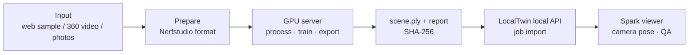
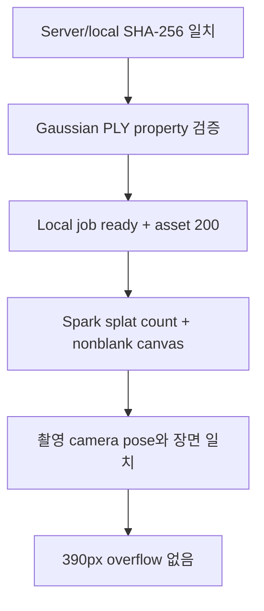

# GPU Scene Validation

> 공식 웹 sample 또는 사용자 촬영물을 GPU server에서 Gaussian Splat으로 변환하고, 결과만 LocalTwin local viewer에서 검증하는 runbook입니다.

## 한눈에 보기



## 입력 조건

| 입력 | 사용 가능 | 조건 |
| --- | --- | --- |
| 일반 사진 | 가능 | 같은 공간을 여러 위치에서 촬영하고 60~80%가량 겹치게 한다. |
| 일반 영상 | 가능 | 한 방향 회전이 아니라 공간을 이동하며 촬영한다. |
| 360 사진 | 조건부 | 서로 다른 위치에서 여러 장을 촬영해야 한다. |
| 360 영상 | 가능 | 이동 경로와 시차가 있어야 한다. |
| 단일 360 panorama | 부적합 | 한 위치의 회전 정보만 있어 깊이 복원 근거가 부족하다. |

웹 sample은 사용 조건이 명확한 공식 dataset을 우선한다. 현재 검증 기준은 Nerfstudio 공식 `storefront` 다중 시점 사진이다. 원본과 학습 결과는 Git 또는 Vercel에 배포하지 않는다.

## Server 실행

현대 CUDA GPU에서는 기본 Docker image를 사용한다.

```bash
docker pull ghcr.io/nerfstudio-project/nerfstudio:1.1.5
python product/scripts/run_gpu_scene_validation.py \
  --mode docker \
  --workspace ~/localtwin-scene-validation
```

Docker가 없는 host worker는 Nerfstudio CLI를 활성화한 뒤 실행한다.

```bash
export CUDA_VISIBLE_DEVICES=0
python product/scripts/run_gpu_scene_validation.py \
  --mode host \
  --workspace ~/localtwin-scene-validation
```

P100 `sm_60` 검증 환경은 최신 gsplat 1.4와 호환되지 않는다. 이 장비에서만 아래 compatibility set을 사용했다.

```text
Python 3.10
PyTorch 2.1.2+cu118
Nerfstudio 1.0.3
gsplat 0.1.13
TORCH_CUDA_ARCH_LIST=6.0
TORCH_COMPILE_DISABLE=1
```

## 결과 가져오기

server가 만든 두 파일만 local ignored directory로 가져온다.

```powershell
scp etri-gpu:/root/localtwin-scene-validation/storefront-run/export/scene.ply `
  product/data/scenes/server-validation/storefront/scene.ply
scp etri-gpu:/root/localtwin-scene-validation/storefront-run/validation-report.json `
  product/data/scenes/server-validation/storefront/validation-report.json
```

Nerfstudio dataset인 경우 camera metadata도 함께 등록한다.

```powershell
uv run --directory product/apps/api python ../../product/scripts/import_scene_asset.py `
  ../../product/data/scenes/server-validation/storefront/scene.ply `
  --scene-name "Local GPU validation" `
  --transforms ../../product/data/scenes/server-validation/storefront/transforms.json `
  --dataparser-transforms ../../product/data/scenes/server-validation/storefront/dataparser_transforms.json
```

명령이 출력한 job id를 사용해 local QA page를 연다.

```text
http://127.0.0.1:5173/splat-smoke.html?asset=/api/v1/scenes/jobs/<job-id>/asset
```

## 검증 기준



실패하면 `validation.log`의 마지막 성공 단계와 오류를 기록한다. GPU memory가 충분하다는 사실만으로 architecture, CUDA compiler와 gsplat kernel 호환성이 보장되지는 않는다.

## 현재 증거

- 내부 실행 증거: `.harness/runs/2026-07-12-SCENE-006-remote-gpu-validation.md` (public deploy 제외)
- [3D 혼잡도 탐색](../features/3d-congestion-explorer.md)
- [개발 환경](../development/environment.md)
